# Outfit boards — 21 September 2026

Six runway looks, six outfits built from real product photographs, laid out as
flat-lay boards. One storyline: **I loved the colour combination in this look,
so I styled it.**

**All text below is publish-ready, and none of it is in your voice yet.**
`voice/` still holds only a README — no samples, no do/don't sheet — so nothing
here has been checked against how you actually write. Treat every Note as a
first draft of the words, not a final one. The CLAUDE.md no-published-text rule
was suspended for this session only, at your instruction.

**How to read this page.** Each board has an **A** version (the runway photograph
on the left) and a **B** version (a palette card instead, for when the photograph
can't be used). Both are 1080 × 1350. Two boards also have a 1456 px landscape
version for the post.

**What the rules are.** Every pairing named below is one of the five general
relationships: **opposition** (hues 100–180° apart, matched relative chroma,
ΔL\* ≥ 15), **tonal** (hues ≤ 40° apart, matched relative chroma, ΔL\* ≥ 25),
**muted** (hues 40–100° apart, both colours under 0.45 relative chroma, ΔL\* ≥ 25),
**monochrome** (two garments within ΔE 12 of each other), and **chromatic on a
neutral ground** (anything under 0.15 relative chroma is ground, and sits with
everything). Every outfit below was checked pair by pair; where a pair fails it
is said so.

---

## Board 1 — Opposition: a cool blue against a warm tan

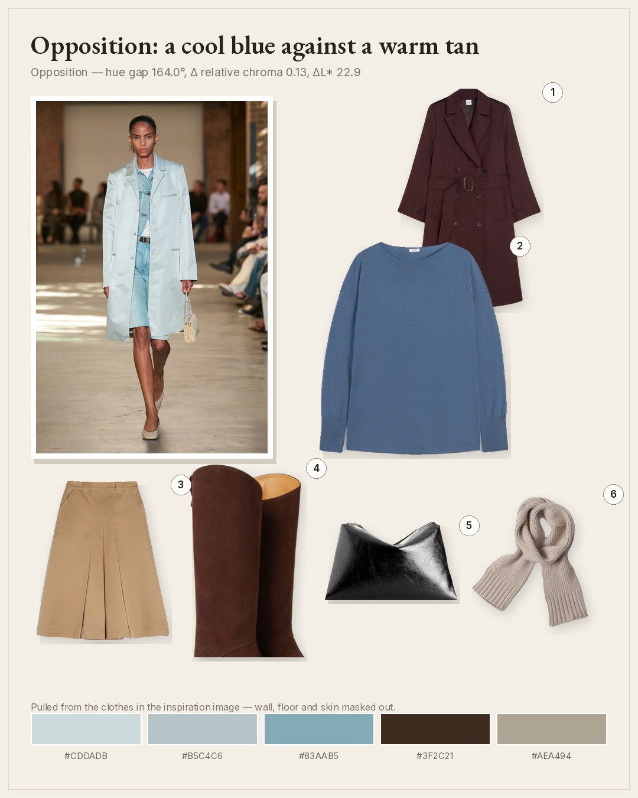 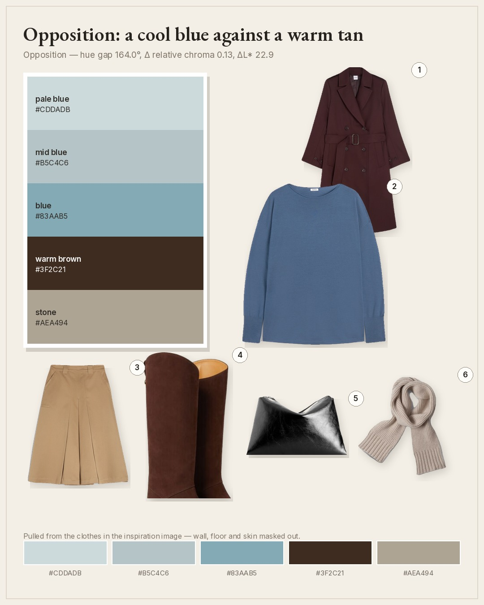

*Landscape version for the post:* 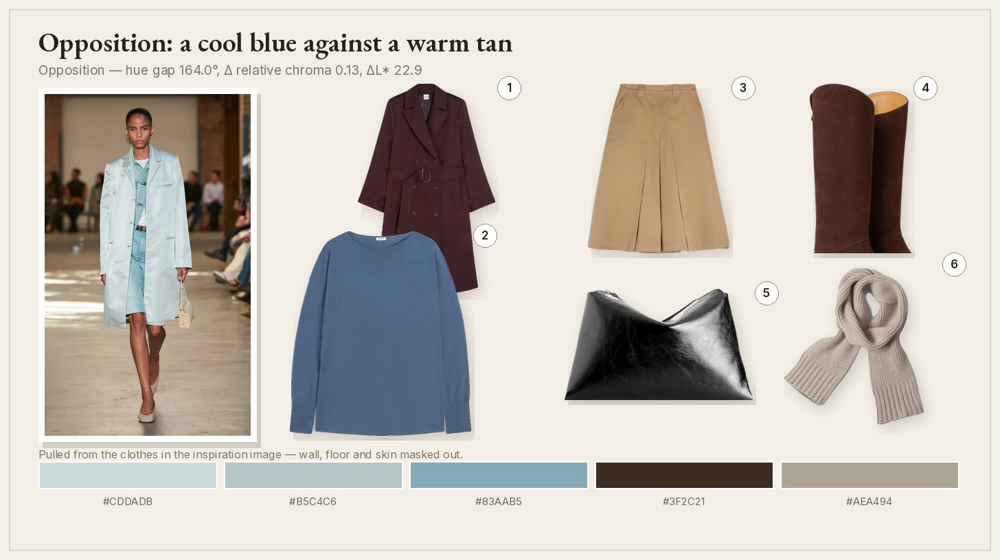

**Note — pattern: *verdict then three-up* (learned from `swipe/fashion shows ss27/IMG_0070.jpeg`,
`IMG_0072.png`: one flat first-person judgement, then the images, no sign-off).**

> A pale blue coat over a warm brown shoe is the only thing I have looked at
> twice this week.
>
> It is the oldest trick there is — a cool colour against a warm one, directly
> across the wheel from it. What makes this version work rather than shout is
> that neither colour is trying very hard. They are the same distance from grey.
> So I built it out of things that exist: a blue merino boat neck, a tan cotton
> gabardine skirt, and a brown boot to land it.

**The pieces**

| # | Piece | Brand | Status in `brands/` | Hex |
|---|---|---|---|---|
| 1 | Double-breasted trench in virgin wool gabardine, colour *Barbera* | Aspesi | **in** `brands/aspesi.yaml` | `#402427` |
| 2 | Boat-neck merino knit, colour *Avio* | Aspesi | **in** `brands/aspesi.yaml` | `#4F6684` |
| 3 | Cotton gabardine skirt, colour *Beige* | Aspesi | **in** `brands/aspesi.yaml` | `#BB9974` |
| 4 | Tall riding boots | **unknown — Nora to confirm** | not in `brands/` | `#4C2A21` |
| 5 | Crinkled leather shoulder bag | COS | not in `brands/` | `#282828` |
| 6 | Ribbed wool scarf | Margaret Howell | not in `brands/` | `#C4B6AB` |

**The colour logic.** The pair doing the work is **2 against 3** — hue gap
**164.0°**, Δ relative chroma **0.13**, ΔL\* **22.9**. That is opposition, and it
passes on all three counts. Everything else sits on it: 1 against 3 is muted
(57.9°, ΔL\* 47.5), 1 against 4 is monochrome (ΔE 6.8), 5 and 6 are neutral
ground.

**Image sources.** Inspiration: *someone else's photo / screenshot* — a runway
gallery in `swipe/fashion shows ss27/IMG_0825.png`; the house is not legible and
is not named. Pieces: *brand product shots*, cut out from the screenshots listed
in `content/swipe/index.csv`.

**What I need from you.** The boot has no legible brand. Confirm it or drop it.

---

## Board 2 — Tonal: one hue, three depths

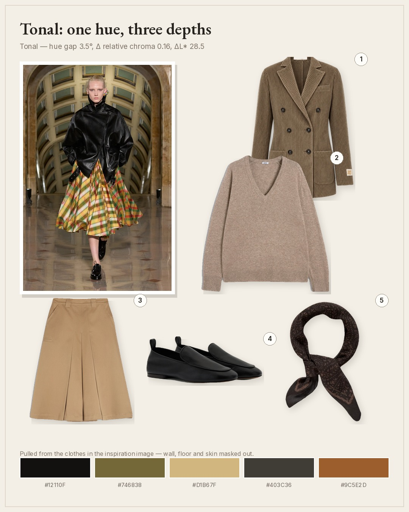 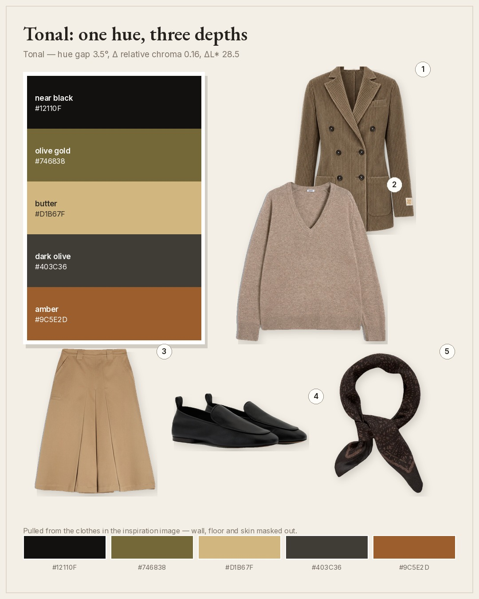

**Note — pattern: *label then three-up* (learned from `swipe/formats/IMG_0074.jpeg`,
`IMG_0108.png`: a bare noun phrase, sometimes just two words and a colon, then
the images carry it).**

> One brown, three times over.
>
> Not a neutral outfit — a single hue held at three different depths, which is a
> different thing and much harder to get wrong. The rule is that the hues stay
> within about forty degrees of each other and the lightness steps stay wide. Do
> that and it reads as deliberate. Skip the lightness step and it reads as
> laundry.

**The pieces**

| # | Piece | Brand | Status in `brands/` | Hex |
|---|---|---|---|---|
| 1 | *Carlotta2* cotton corduroy double-breasted jacket, colour *Taupe* | Massimo Alba | **in** `brands/massimo-alba.yaml` | `#6A5540` |
| 2 | V-neck wool-cashmere knit | Aspesi | **in** `brands/aspesi.yaml` | `#B39D8B` |
| 3 | Cotton gabardine skirt, colour *Beige* | Aspesi | **in** `brands/aspesi.yaml` | `#BB9974` |
| 4 | Soft flat loafers with pull tab | soeur | not in `brands/` | `#232323` |
| 5 | Cashmere-and-silk bandana, deep brown | Massimo Alba | **in** `brands/massimo-alba.yaml` | `#281E1B` |

**The colour logic.** **2 against 1** is tonal — hue gap **3.5°**, Δ relative
chroma **0.16**, ΔL\* **28.5**. **2 against 3** is monochrome at **ΔE 6.6** — the
same colour twice, which the rules allow outright. Every other pair on the board
is also tonal: 1–3 (2.1°, ΔL\* 27.7), 1–5 (28.4°, ΔL\* 25.4), 3–5 (30.4°,
ΔL\* 53.1), 2–5 (24.9°, ΔL\* 53.8). It is the most internally consistent board
of the six.

**Image sources.** Inspiration: *someone else's photo / screenshot*
(`swipe/fashion shows ss27/IMG_0811.png`), house not legible, not named.
Pieces: *brand product shots*.

**Missing piece.** No bag. Nothing in the cut-out pool pairs with five browns
without going flat against one of them — what this needs is a bag around
**L\* 40–50**, mid-depth, so it lands between the jacket and the skirt.

---

## Board 3 — Monochrome: the same colour, twice over

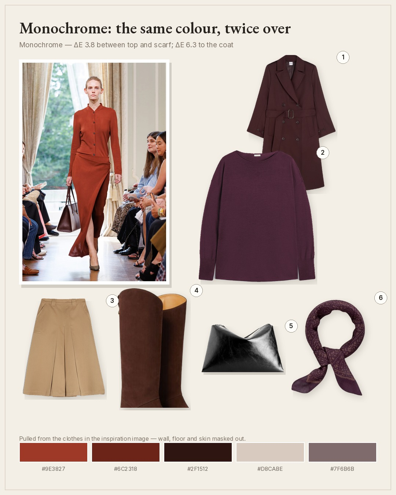 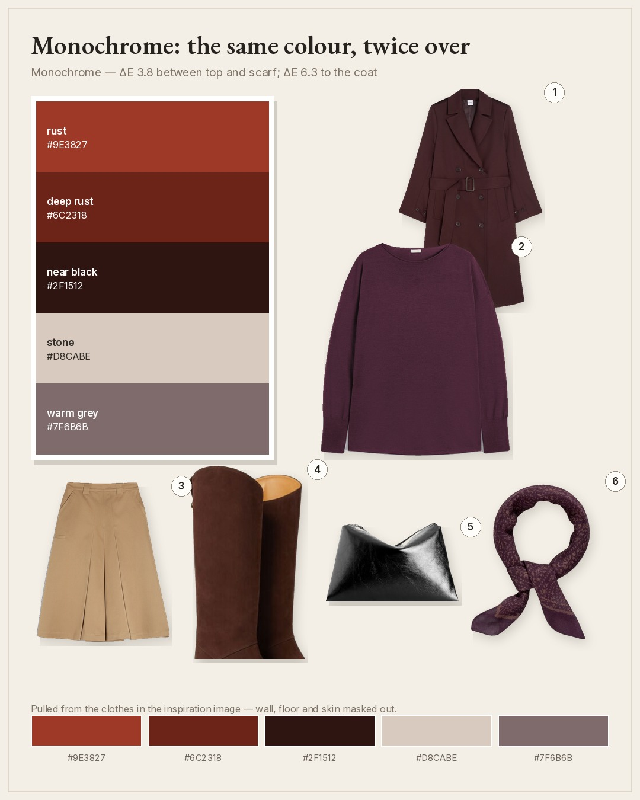

**Note — pattern: *confession* (learned from `swipe/products/IMG_0233.jpeg`,
`IMG_0497.png`: a small admission in one line, then the images, ending on a
half-line aside).**

> I keep saying I like colour and then I build this: one dark red, four times.
>
> The thing about wearing one colour repeatedly down an outfit is that it only
> works if the depths differ enough to be read as a decision. Here the knit and
> the scarf are within a hair of each other — three points of difference — and
> the coat is a shade deeper again. Close enough to rhyme, far enough not to
> look like a set.

**The pieces**

| # | Piece | Brand | Status in `brands/` | Hex |
|---|---|---|---|---|
| 1 | Double-breasted trench in virgin wool gabardine, colour *Barbera* | Aspesi | **in** `brands/aspesi.yaml` | `#402427` |
| 2 | Boat-neck merino knit, burgundy | Aspesi | **in** `brands/aspesi.yaml` | `#4B2838` |
| 3 | Cotton gabardine skirt, colour *Beige* | Aspesi | **in** `brands/aspesi.yaml` | `#BB9974` |
| 4 | Tall riding boots | **unknown — Nora to confirm** | not in `brands/` | `#4C2A21` |
| 5 | Crinkled leather shoulder bag | COS | not in `brands/` | `#282828` |
| 6 | Cashmere-and-silk bandana, burgundy | Massimo Alba | **in** `brands/massimo-alba.yaml` | `#3D212D` |

**The colour logic.** Four monochrome pairs on one board: **2–6** at ΔE **3.8**,
**1–6** at ΔE **4.4**, **1–2** at ΔE **6.3**, **1–4** at ΔE **6.8**. The tan
skirt is what stops it being a costume — **2 against 3** is muted (hue gap
**82.4°**, Δ relative chroma **0.07**, ΔL\* **44.2**).

**Image sources.** Inspiration: *someone else's photo / screenshot*
(`swipe/fashion shows ss27/IMG_0843.png`). Pieces: *brand product shots*.

**What I need from you.** Same boot question as board 1.

---

## Board 4 — Muted: two quiet colours, far apart in lightness

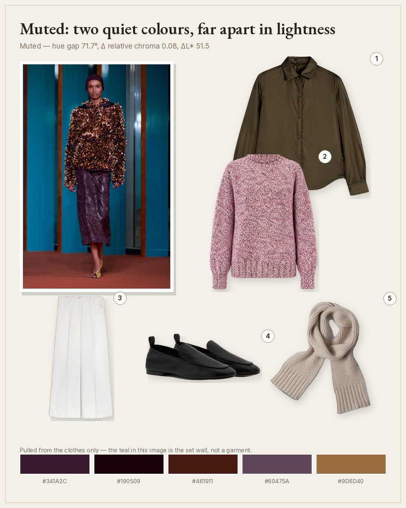 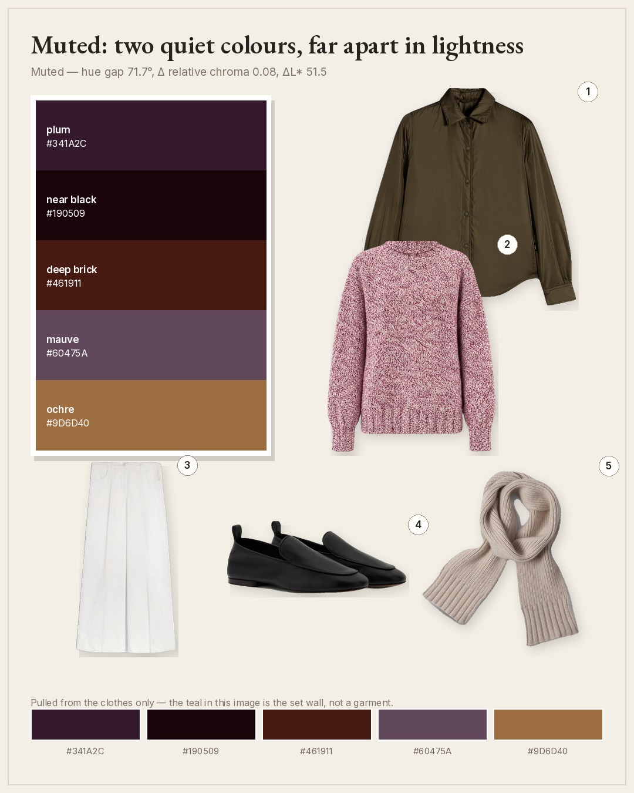

**Note — pattern: *colour-led label* (learned from `swipe/formats/IMG_0102.jpeg`,
`IMG_0108.png`: name a colour or a pairing as the whole caption and prove it
across the images).**

> Faded pink and a dark olive.
>
> This is the quietest of the three ways two colours can sit together, and the
> one people talk about least. The hues are neither opposite nor neighbours —
> they are about seventy degrees apart, which is the awkward middle. It only
> holds because both colours are low in saturation and there is a very wide
> lightness step between them. Fifty-one points, in this case. That gap is the
> whole outfit.

**The pieces**

| # | Piece | Brand | Status in `brands/` | Hex |
|---|---|---|---|---|
| 1 | Short blouson jacket, olive | Aspesi | **in** `brands/aspesi.yaml` | `#4F432F` |
| 2 | *Virginia* virgin wool and alpaca sweater, colour *Raspberry* | Massimo Alba | **in** `brands/massimo-alba.yaml` | `#E2C0C4` |
| 3 | Wide-leg velvet trousers, cream | Aspesi | **in** `brands/aspesi.yaml` | `#E8E7E4` |
| 4 | Soft flat loafers with pull tab | soeur | not in `brands/` | `#232323` |
| 5 | Ribbed wool scarf | Margaret Howell | not in `brands/` | `#C4B6AB` |

**The colour logic.** **2 against 1** — hue gap **71.7°**, Δ relative chroma
**0.08**, ΔL\* **51.5**. Muted, and it passes all four of that band's tests.
Everything else is neutral ground.

**Image sources.** Inspiration: *someone else's photo / screenshot*
(`swipe/fashion shows ss27/IMG_0860.png`). Pieces: *brand product shots*.

**Worth saying out loud.** The teal in that photograph is the **set wall**, not
a garment. Extract the clothes only and the teal disappears entirely — what is
left is ochre, plum and a deep brick. Half of what makes that picture is a wall
nobody owns.

**Missing piece.** No bag.

---

## Board 5 — One colour on a neutral ground

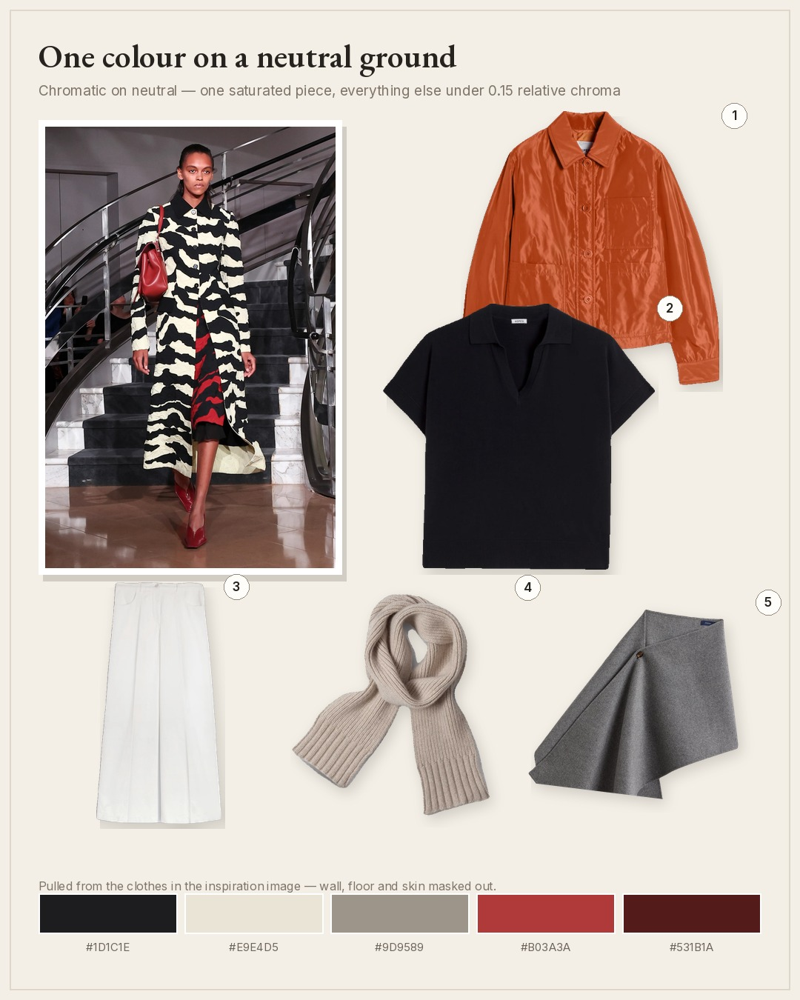 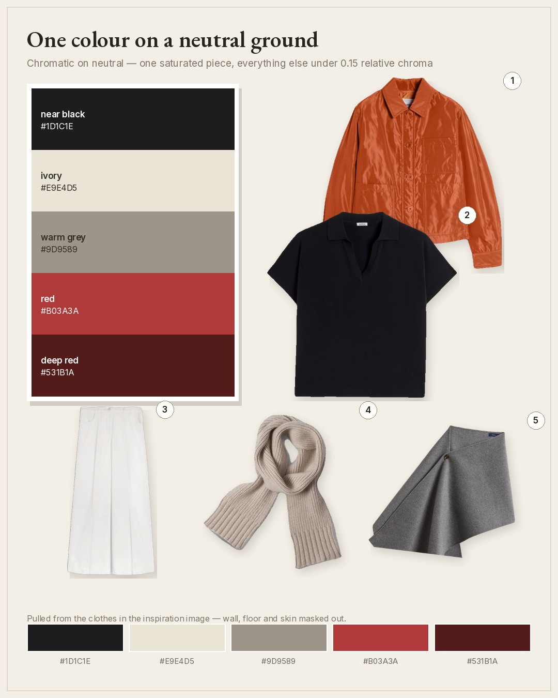

**Note — pattern: *verdict then three-up*, second use (`swipe/fashion shows ss27/IMG_0070.jpeg`).**

> A print coat with one red repeated three times — bag, hem, shoe.
>
> I do not own anything like that coat and I am not going to. What travels is
> the arithmetic underneath it: one saturated thing, everything else quiet
> enough to be furniture. Quiet has a number — under fifteen per cent of the
> saturation available at that lightness. Below that line a colour stops
> competing and becomes ground.

**The pieces**

| # | Piece | Brand | Status in `brands/` | Hex |
|---|---|---|---|---|
| 1 | Technical jacket padded with Thermore wadding, colour *Zucca* | Aspesi | **in** `brands/aspesi.yaml` | `#AC431E` |
| 2 | Short-sleeve knit polo, black | Aspesi | **in** `brands/aspesi.yaml` | `#16151A` |
| 3 | Wide-leg velvet trousers, cream | Aspesi | **in** `brands/aspesi.yaml` | `#E8E7E4` |
| 4 | Ribbed wool scarf | Margaret Howell | not in `brands/` | `#C4B6AB` |
| 5 | Double-faced wool buttoned cape | soeur | not in `brands/` | `#6D6B6D` |

**The colour logic.** Piece 1 sits at **0.78** relative chroma. Pieces 2–5 sit at
**0.09, 0.02, 0.12 and 0.01**. One voice, four grounds. That is the whole rule.

**Image sources.** Inspiration: *someone else's photo / screenshot*
(`swipe/fashion shows ss27/IMG_0862.png`). Pieces: *brand product shots*.

**Missing pieces — and this one is interesting.** **No shoes.** Every shoe in the
pool fails: the black loafer goes flat against the black polo (ΔL\* 6.7, and two
neutrals need 15), and the brown boot fails tonal against the jacket (hue gap
5.3°, ΔL\* 21.4 where 25 is wanted). What this needs is a shoe at roughly
**L\* 45–55** in a true neutral. **No bag** either: the only mid-tone bag in the
library is a luxury house and is therefore inspiration only.

---

## Board 6 — Opposition at full strength

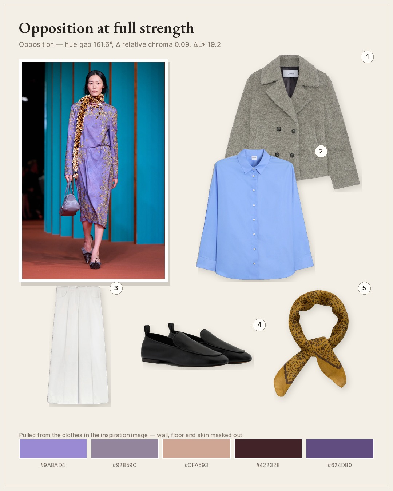 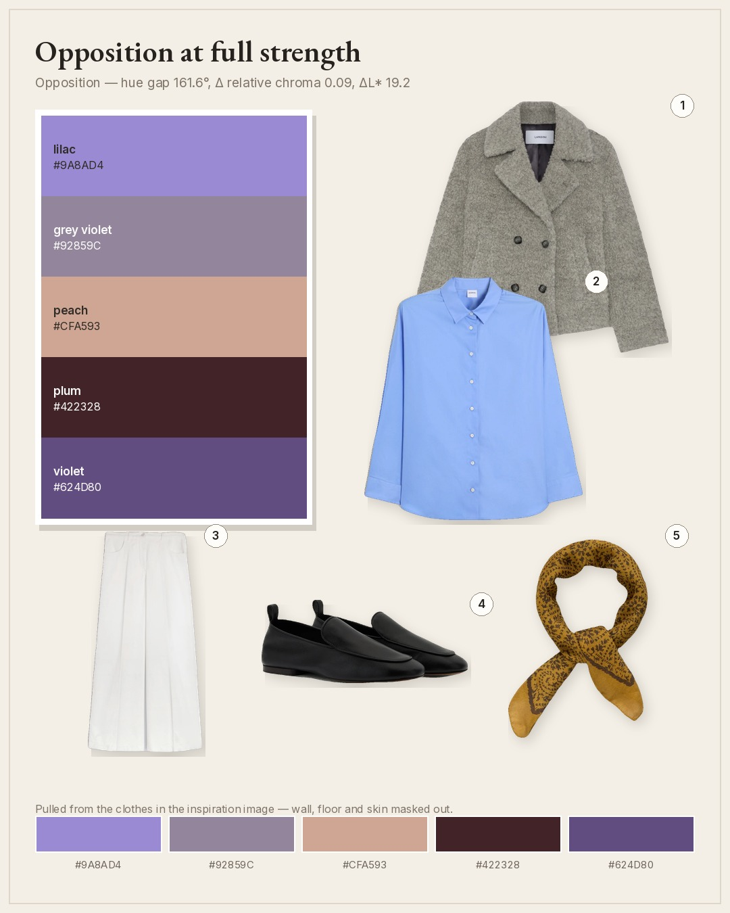

*Landscape version for the post:* 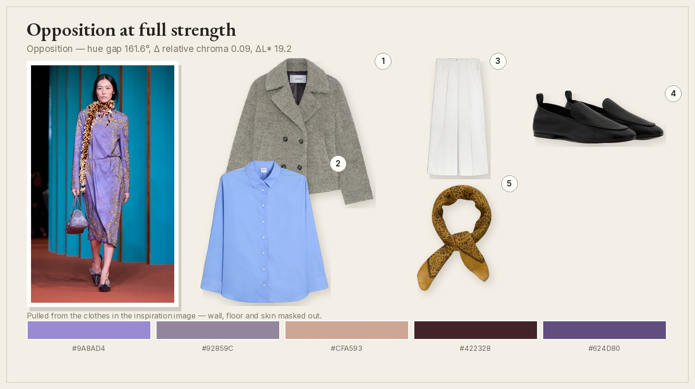

**Note — pattern: *question* (learned from `swipe/formats/IMG_0095.png`: the
question is the first line, not the last, and the replies do the closing).**

> Would you put a mustard scarf on a pale blue shirt?
>
> I would, and here is why it is not a risk. Those two are almost exactly
> opposite on the wheel — a hundred and sixty-two degrees apart — and, more to
> the point, they are equally saturated. That second part is what people miss.
> Opposite hues at matched intensity vibrate pleasantly. Opposite hues at
> mismatched intensity just look like one of them is wrong.

**The pieces**

| # | Piece | Brand | Status in `brands/` | Hex |
|---|---|---|---|---|
| 1 | Short double-breasted pea coat in alpaca and mohair bouclé | Lardini | **in** `brands/lardini.yaml` | `#8F8B81` |
| 2 | Cotton poplin shirt, light blue | Aspesi | **in** `brands/aspesi.yaml` | `#97B8F5` |
| 3 | Wide-leg velvet trousers, cream | Aspesi | **in** `brands/aspesi.yaml` | `#E8E7E4` |
| 4 | Soft flat loafers with pull tab | soeur | not in `brands/` | `#232323` |
| 5 | *Bandana* cashmere-and-silk bandana, colour *Nugget Gold* | Massimo Alba | **in** `brands/massimo-alba.yaml` | `#AA7C2F` |

**The colour logic.** **2 against 5** — hue gap **161.6°**, Δ relative chroma
**0.09**, ΔL\* **19.2**. Opposition, and the tightest chroma match on any of the
six boards. Both pieces are near the top of their available saturation (0.86 and
0.77), which is why this one is loud where board 1 is quiet, on the same rule.

**Image sources.** Inspiration: *someone else's photo / screenshot*
(`swipe/fashion shows ss27/IMG_0851.png`). Pieces: *brand product shots*.

**Missing piece.** No bag.

---

## Four more Notes, with made visuals

Not board notes — the strongest angles from `content/review-2026-09-20.md`,
each with a visual made for it rather than a screenshot.

### Note A — "Four colours. Every one of them fine."

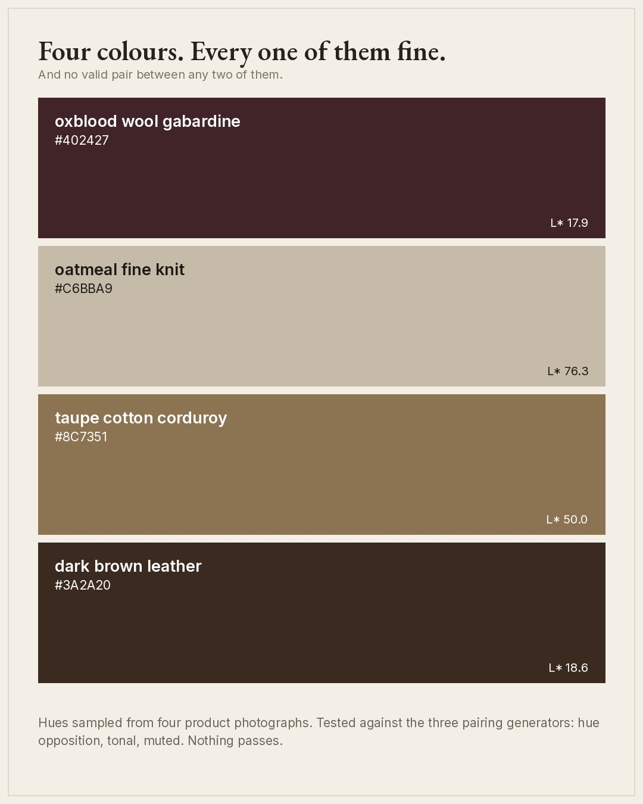

**Pattern: *confession* (`swipe/products/IMG_0233.jpeg`).**

> I put four colours together that I liked individually and the result was
> nothing at all.
>
> This is the bit colour advice skips. Knowing which colours suit you and
> knowing which two go together are different questions with different answers,
> and almost everything published answers only the first. These four are all
> perfectly good. There is no valid pair between any two of them.

*Image source: made for this — a palette card, hexes sampled from four product
photographs.*

### Note B — "Tan on green should be camouflage."

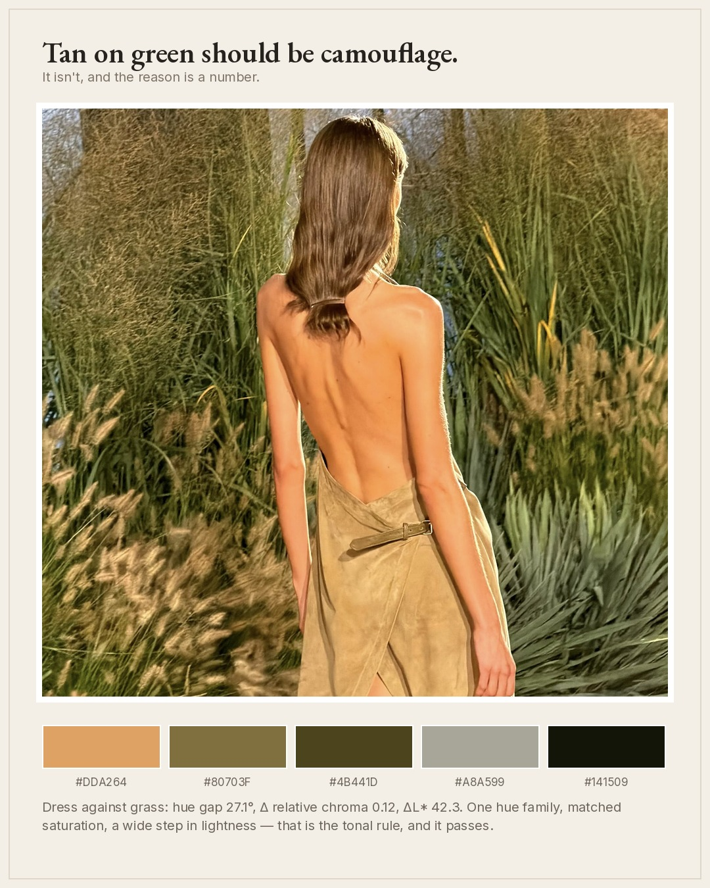

**Pattern: *label then three-up*, adapted to one image (`swipe/formats/IMG_0108.jpeg`).**

> Everyone saves this picture. Nobody says why it works.
>
> A tan dress standing in green grass ought to disappear and instead it steps
> forward. The hues are twenty-seven degrees apart, which is close — same
> family. The saturations match almost exactly. And the lightness gap is
> forty-two points, which is enormous. Close hue, matched intensity, wide
> lightness step: that is the tonal rule, and it is the most useful one to
> learn first.

*Image source: someone else's photo / screenshot — `swipe/visuals/IMG_0066.png`.
The swatch strip is made. **The garment reads as suede but no fibre is stated
anywhere in the image, so it is not called suede.***

### Note C — "Denim is not a colour."

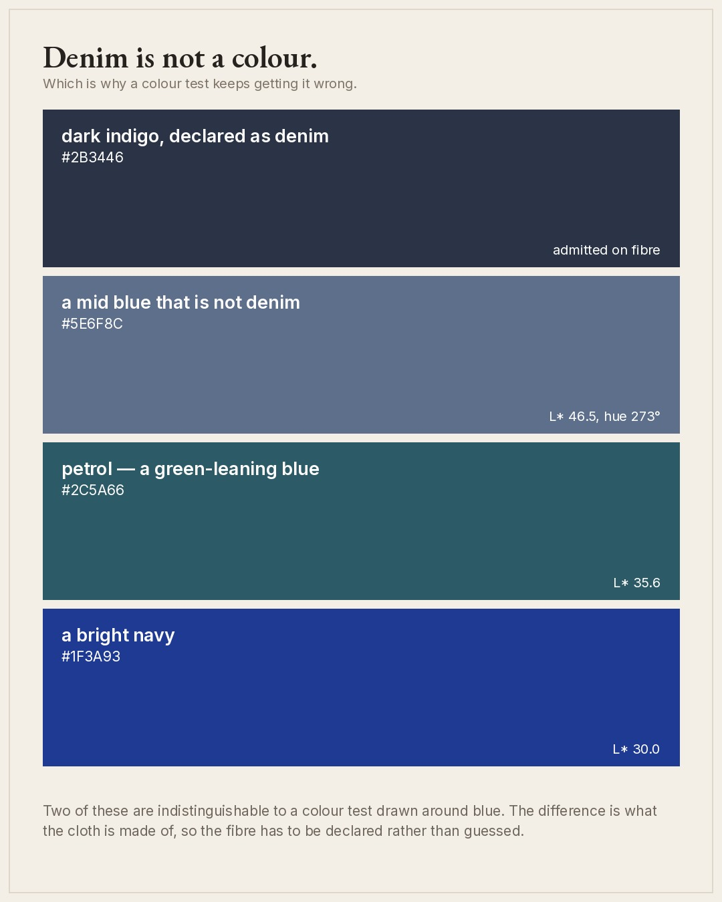

**Pattern: *verdict* (`swipe/formats/IMG_0072.jpeg`).**

> Denim is not a colour, and any system that treats it as one will eventually
> tell you to get rid of your jeans.
>
> Two of the blues on this card are indistinguishable to a test drawn around
> "denim". One of them is denim. The other is a perfectly ordinary blue that a
> lot of people have in a knit. The only thing that separates them is what the
> cloth is made of — so it has to be declared, not guessed. Small point, and it
> is the difference between advice you can follow and advice you quietly ignore.

*Image source: made for this — a palette card.*

### Note D — "Two reds, one step apart."

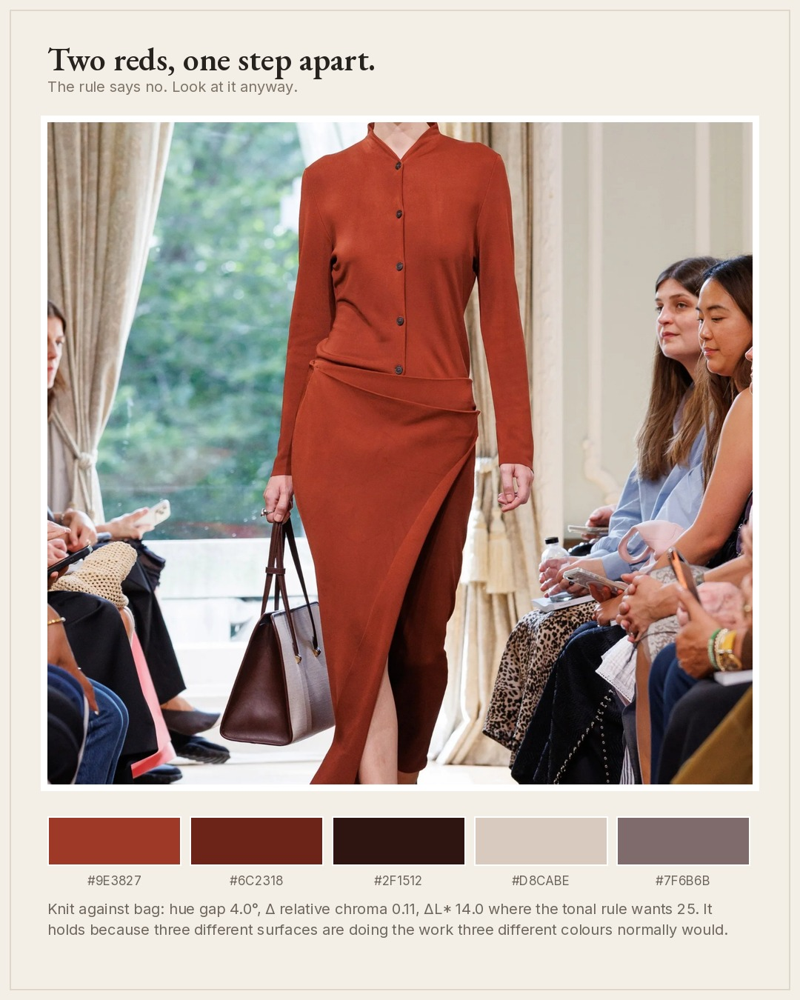

**Pattern: *question* (`swipe/formats/IMG_0095.png`).**

> When does a rule stop being worth obeying?
>
> Head-to-toe rust with a deeper red bag. By the numbers this fails: the
> lightness gap is fourteen points where the rule wants twenty-five. And it
> obviously works. What is holding it up is not colour at all — it is that the
> knit, the wrap and the leather catch light three different ways. A rule that
> only counts colour cannot see that, which is worth knowing before you let one
> tell you what to wear.

*Image source: someone else's photo / screenshot —
`swipe/fashion shows ss27/IMG_0843.png`. The swatch strip is made.*

---

## What I need you to supply

1. **Your voice.** `voice/` is still a README and nothing else. Every word above
   is labelled *not my voice yet* for that reason. Two or three samples of your
   own writing would let the next pass fix it.
2. **The boot on boards 1 and 3.** No legible brand
   (`swipe/products/IMG_0698.png`). Confirm it or I drop it.
3. **Whether Lardini and Massimo Alba are allowed on a board.** Your rule is that
   runway and luxury houses are inspiration only. `brands/` records Lardini and
   Massimo Alba as `price_band: upper`, not `luxury` — so I used them. Aspesi,
   Closed and Barena are `mid`; COS, soeur, Margaret Howell and A.P.C. are not in
   `brands/` at all. **If *upper* counts as luxury for this rule, boards 2, 3 and
   6 need rebuilding.**
4. **A shoe around L\* 45–55 in a neutral, and a bag around L\* 40–50.** These are
   the two gaps that recurred across all six boards — see boards 2, 4, 5 and 6.
5. **Whether the swatch strip and the numbered labels stay.** They are our
   invention: in 120 screenshots of other writers, nobody numbers a board and
   nobody publishes a hex. See `content/boards/style-spec.md` part B4.

## Cut-outs

All accepted cut-outs are in `content/boards/cutouts/` as transparent PNGs named
`slot_name.png`. **No original image was moved, renamed, deleted or re-encoded.**

**Method:** `rembg` with the `u2net` model, run on a chrome-trimmed crop of each
product page, then alpha hard-thresholded at 200 and reduced to its largest
connected components to drop stray fragments. The flood-fill fallback was not
needed — the model downloaded and ran.

**Rejected — for the iPad list.** 18 of 66 attempts were rejected on inspection
and are **not** in the repository. Cut these by hand if you want them:

| File | Why it was rejected |
|---|---|
| `products/IMG_0421.png` brown ribbed scarf | leftover white page-UI strip fused to the cut-out |
| `products/IMG_0355.png` rosewood scarf | the whole product-page panel survived instead of the scarf |
| `products/IMG_0436.png` sienna hood | the whole product-page panel survived alongside the hood |
| `products/IMG_0231.png` pale blue balaclava | worn shot — the model's face and a second garment came with it |
| `products/IMG_0212.png` Barbera velvet trousers | full model cut-out, not a flat piece |
| `products/IMG_0209.png` navy check pleated skirt | full model cut-out |
| `products/IMG_0182.png` navy gabardine trousers | crop landed on a model wearing a different jacket |
| `products/IMG_0226.png` burgundy corduroy trousers | full model cut-out |
| `products/IMG_0283.png` camel peacoat | full model cut-out, head cropped |
| `products/IMG_0258.png` deep brown cashmere coat | full model cut-out |
| `products/IMG_0196.png` navy hooded jacket | crop landed on the model shot, not the packshot |
| `products/IMG_0509.png` black collarless jacket | white rectangular UI fragment fused to the hem |
| `products/IMG_0045.png` black pointed mules | two separate shots at wildly different scales in one cut-out |
| `products/IMG_0285.png` brown wool-cashmere sweater | full model cut-out |
| `products/IMG_0175.png` cream knit polo | badly clipped — only a corner survived |
| `products/IMG_0177.png` navy knit polo | badly clipped — only a corner survived |
| `products/IMG_0520.png` rust half-zip knit | white block from the model's skirt fused to the hem |
| `products/IMG_0171.png` white poplin shirt | empty cut-out — no subject found on a white-on-white packshot |

One more was cut cleanly and then **withdrawn**: the tan top-handle bag from
`products/IMG_0690.png` turned out to carry a legible **Jil Sander** wordmark.
Jil Sander is a luxury house and is not in `brands/`, so under your rule it
cannot appear on a board. Board 5 uses a soeur wool cape in its place, and the
index row has been corrected.
