# Boards v2 — 21 September 2026

Six boards, built from `content/catalogue/products.csv`. The storyline is the same
one every time: *I loved the colour combination in this runway look, so I styled it.*

What changed since the first set: every piece is now checked against the
inspiration image's own colours rather than against the other pieces, the pool is
463 catalogued products instead of 48 cut-outs, and no product appears on more than
two boards. The acceptance table under each board is the test it had to pass; none
of it appears on the image itself.

**All text on this page is a draft — not my voice yet.**

| Board | Title | Key colours | Result |
|---|---|---|---|
| 1 | One rust, top to toe | rust, off-black | passes |
| 2 | Pale on pale, one warm thing | lilac, rust | passes |
| 3 | Ochre over black | black, ochre, olive | passes |
| 4 | Brick, and nothing else loud | brick, rust | passes |
| 5 | Black, and one thing that isn't | off-black, olive | passes |
| 6 | Cream, with brown underneath | cream, tobacco, oxblood | passes |

---

## Board 1 — One rust, top to toe

*Same colour three times, three different weights.*

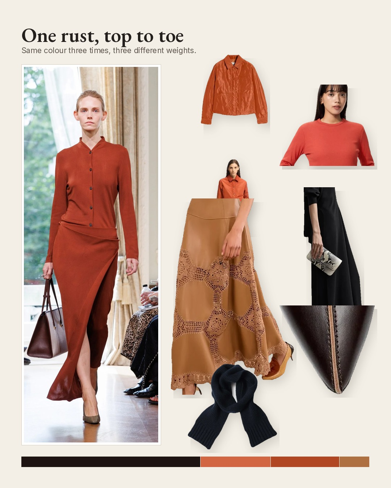 
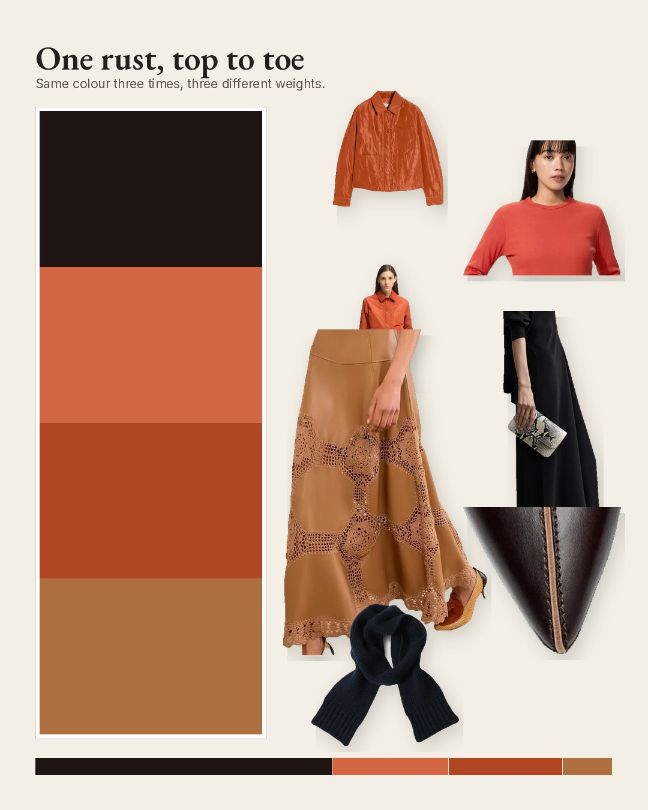 

Notes size 1080×1350, JPEG under 1 MB.

### Acceptance test

| Test | Result | Detail |
|---|---|---|
| every key colour carried | pass | all carried |
| an accent stays an accent | pass | off-black on shoes, bag |
| no foreign chromatic colour | pass | refused at selection; neutrals free |
| all components present | pass | layer, top, bottom, shoes, bag, accessory |
| neutral fillers declared | pass | bottom, accessory |
| no product on more than two boards | pass | checked across all six boards |

### The pieces

| # | Slot | Product | What it is | Colour | Brand | Confidence | Carries |
|---|---|---|---|---|---|---|---|
| 1 | layer | `B015-P003` | padded technical-fabric jacket | rust | ASPESI | ✓ given | rust (within the threshold) |
| 2 | top | `B062-P005` | long-sleeve ribbed t-shirt | terracotta | UNIQLO | ✓ given | terracotta (within the threshold) |
| 3 | bottom | `B050-P002` | long leather skirt with crochet lace panels | ochre | KHAITE | ? guessed | ochre — neutral filler, no colour match |
| 4 | shoes | `B001-P004` | pointed kitten-heel leather mules | espresso | Massimo Dutti | ✓ given | espresso (within the threshold) |
| 5 | bag | `B043-P006` | snake-print flap clutch bag | black | — | — input needed | black (within the threshold) |
| 6 | accessory | `B031-P001` | narrow ribbed knit scarf | black | MARGARET HOWELL | ✓ given | black — neutral filler, no colour match |

### Note (pattern: *verdict*)

> Rust does not need a second colour.
> >
> > Three rust things in one outfit sounds like too many until you see it: a padded
> jacket, a fine ribbed knit, a scarf. Same colour, three different weights, and
> it reads as one thing with texture rather than three things competing. The dark
> brown shoes and bag are there to stop it, not to join in.

*Not my voice yet.*

*Image sources: the inspiration photograph is someone else's photo, screenshotted from a fashion-week gallery (`content/swipe/fashion shows ss27/IMG_0843.png`) — it is colour and trend inspiration only. Every piece is a brand product shot, screenshotted from the brand or retailer's own site.*

### Swap or confirm before publishing

- `B050-P002` long leather skirt with crochet lace panels — brand is guessed
- `B043-P006` snake-print flap clutch bag — brand is input needed

---

## Board 2 — Pale on pale, one warm thing

*Everything quiet except the boots.*

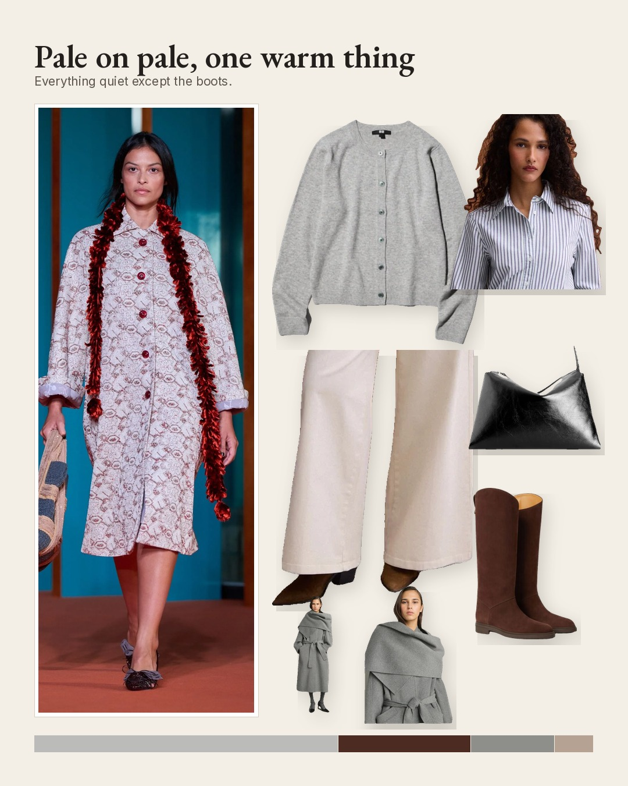 
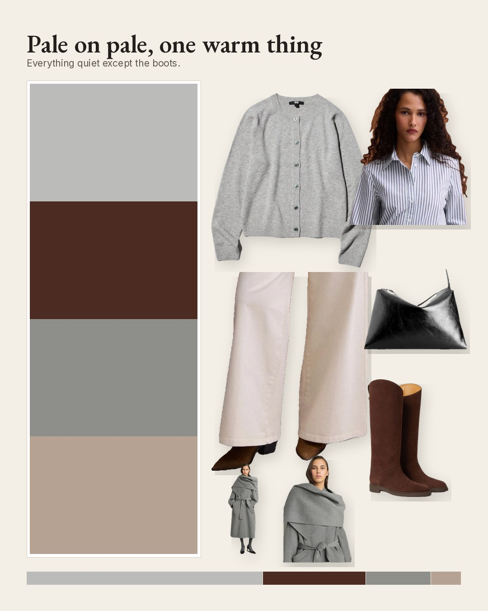 

Notes size 1080×1350, JPEG under 1 MB.

### Acceptance test

| Test | Result | Detail |
|---|---|---|
| every key colour carried | pass | all carried |
| an accent stays an accent | pass | rust on shoes |
| no foreign chromatic colour | pass | refused at selection; neutrals free |
| all components present | pass | layer, top, bottom, shoes, bag, accessory |
| neutral fillers declared | pass | bag, accessory |
| no product on more than two boards | pass | checked across all six boards |

### The pieces

| # | Slot | Product | What it is | Colour | Brand | Confidence | Carries |
|---|---|---|---|---|---|---|---|
| 1 | layer | `B058-P005` | cashmere crew neck short cardigan | light grey | UNIQLO | ✓ given | light grey (within the threshold) |
| 2 | top | `B007-P001` | striped poplin button-front shirt | pale grey | PIOMBO | ✓ given | pale grey (within the threshold) |
| 3 | bottom | `B007-P002` | wide-leg five-pocket ecru trousers | cream | PIOMBO | ✓ given | cream (within the threshold) |
| 4 | shoes | `B055-P001` | knee-high flat suede riding boots | espresso | Loro Piana | ✓ given | espresso (within the threshold) |
| 5 | bag | `B056-P004` | leather shoulder bag | black | COS | ✓ given | black — neutral filler, no colour match |
| 6 | accessory | `B037-P008` | double-faced wool buttoned cape | stone | SOEUR | ✓ given | stone — neutral filler, no colour match |

### Note (pattern: *label*)

> Pale on pale, and one warm thing.
> >
> > A grey cardigan, a fine striped shirt, ecru trousers. Then brown boots, because
> an outfit this quiet needs one piece with some weight in it or the whole thing
> floats off.

*Not my voice yet.*

*Image sources: the inspiration photograph is someone else's photo, screenshotted from a fashion-week gallery (`content/swipe/fashion shows ss27/IMG_0861.png`) — it is colour and trend inspiration only. Every piece is a brand product shot, screenshotted from the brand or retailer's own site.*

### Swap or confirm before publishing

- nothing on this board: every brand is legible in its own screenshot

---

## Board 3 — Ochre over black

*The jacket does the talking and everything under it stays quiet.*

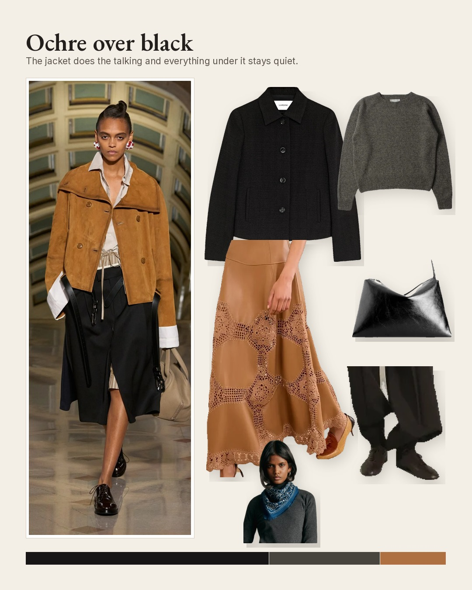 
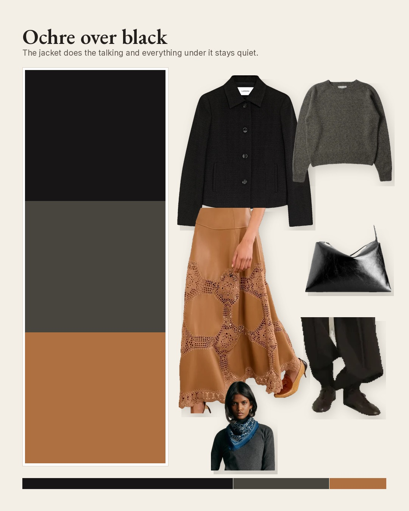 

Notes size 1080×1350, JPEG under 1 MB.

Post size, 1456px wide, with numbered labels:

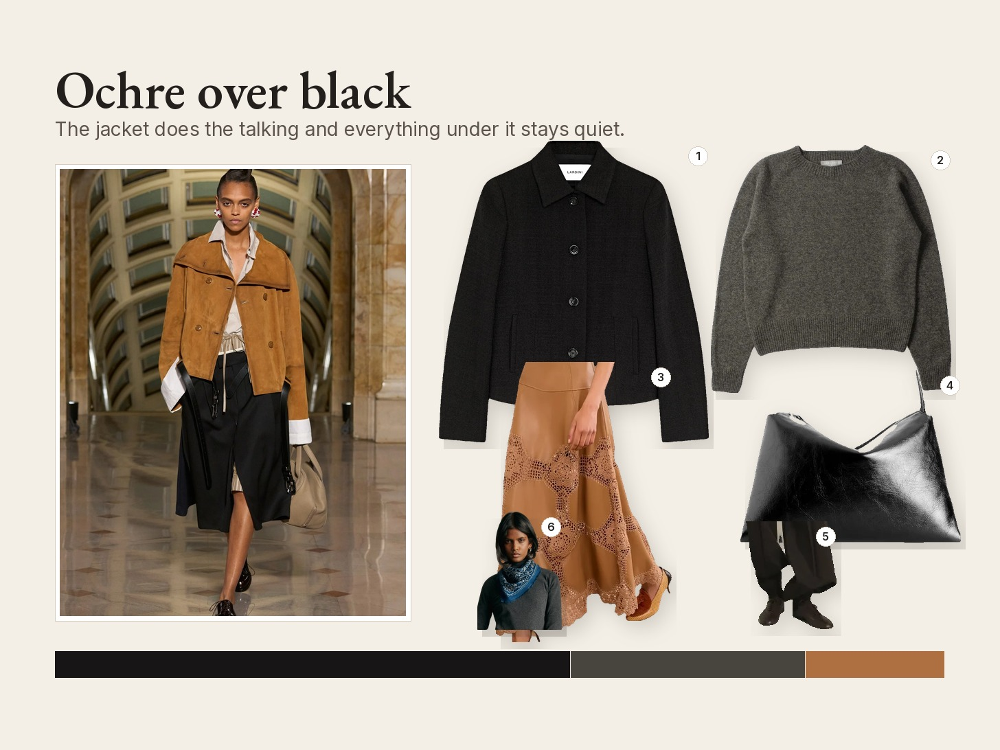 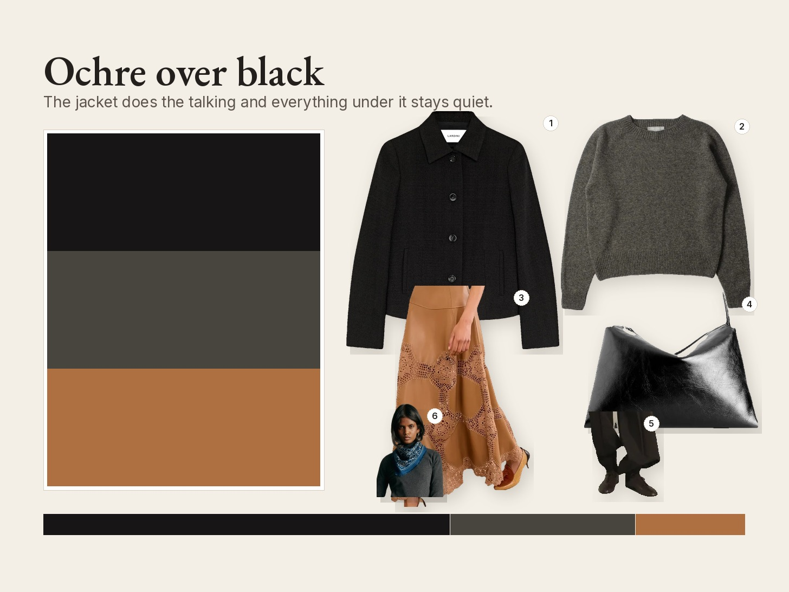

### Acceptance test

| Test | Result | Detail |
|---|---|---|
| every key colour carried | pass | all carried |
| an accent stays an accent | pass | no accent in the look |
| no foreign chromatic colour | pass | refused at selection; neutrals free |
| all components present | pass | layer, top, bottom, shoes, bag, accessory |
| neutral fillers declared | pass | none |
| no product on more than two boards | pass | checked across all six boards |

### The pieces

| # | Slot | Product | What it is | Colour | Brand | Confidence | Carries |
|---|---|---|---|---|---|---|---|
| 1 | layer | `B021-P019` | short collared button-front jacket | black | LARDINI | ✓ given | black (within the threshold) |
| 2 | top | `B031-P006` | crew neck knit jumper | taupe | — | — input needed | taupe (within the threshold) |
| 3 | bottom | `B050-P002` | long leather skirt with crochet lace panels | ochre | KHAITE | ? guessed | ochre (within the threshold) |
| 4 | shoes | `B039-P003` | soft leather lace-up derbies | black | SOEUR | ✓ given | black (within the threshold) |
| 5 | bag | `B056-P004` | leather shoulder bag | black | COS | ✓ given | black (within the threshold) |
| 6 | accessory | `B055-P003` | fringed wool twill bandana scarf | black | SÉZANE | ✓ given | black (within the threshold) |

### Note (pattern: *confession*)

> I always assume ochre will be too much, and it never is.
> >
> > The trick seems to be that it only gets one job. Here it is a leather skirt and
> everything above it — a black jacket, a grey knit, a black bag — stays flat and
> dark, so the skirt is the only thing doing any work.

*Not my voice yet.*

*Image sources: the inspiration photograph is someone else's photo, screenshotted from a fashion-week gallery (`content/swipe/fashion shows ss27/IMG_0814.png`) — it is colour and trend inspiration only. Every piece is a brand product shot, screenshotted from the brand or retailer's own site.*

### Swap or confirm before publishing

- `B031-P006` crew neck knit jumper — brand is input needed
- `B050-P002` long leather skirt with crochet lace panels — brand is guessed

---

## Board 4 — Brick, and nothing else loud

*One strong colour and three quiet ones underneath.*

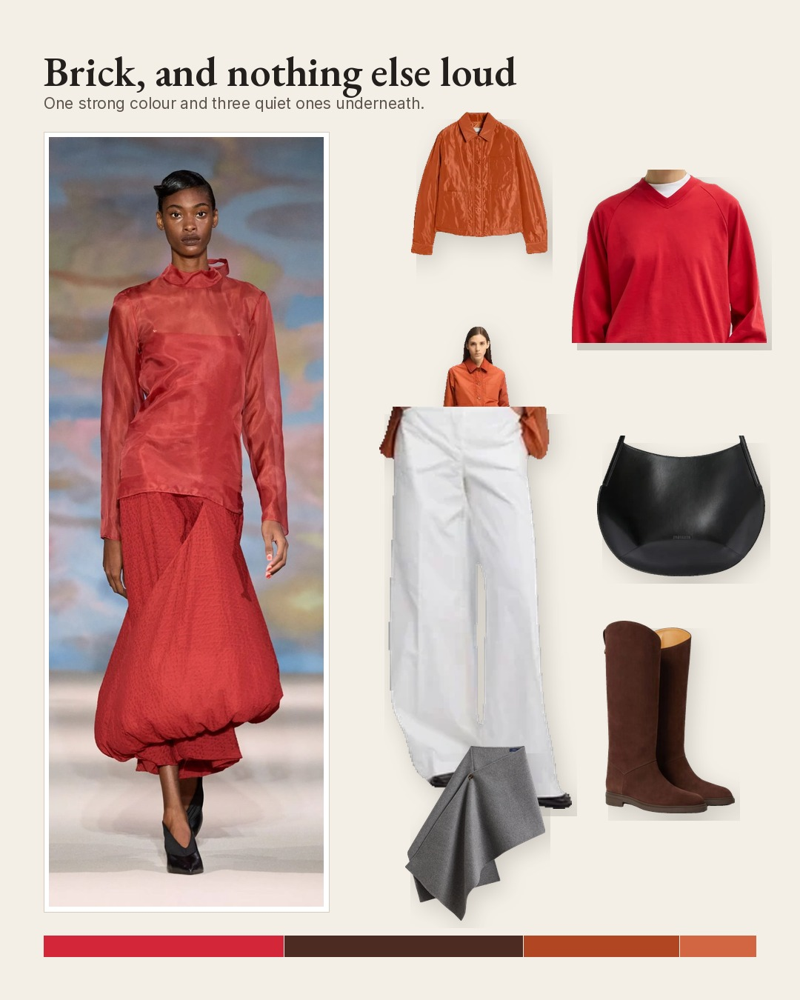 
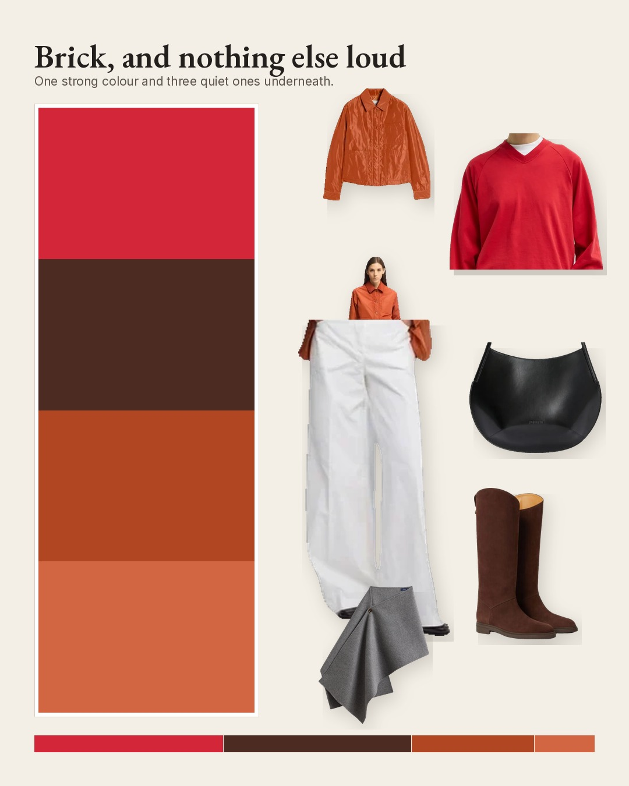 

Notes size 1080×1350, JPEG under 1 MB.

### Acceptance test

| Test | Result | Detail |
|---|---|---|
| every key colour carried | pass | all carried |
| an accent stays an accent | pass | no accent in the look |
| no foreign chromatic colour | pass | refused at selection; neutrals free |
| all components present | pass | layer, top, bottom, shoes, bag, accessory |
| neutral fillers declared | pass | bottom, shoes, bag, accessory |
| no product on more than two boards | pass | checked across all six boards |

### The pieces

| # | Slot | Product | What it is | Colour | Brand | Confidence | Carries |
|---|---|---|---|---|---|---|---|
| 1 | layer | `B015-P003` | padded technical-fabric jacket | rust | ASPESI | ✓ given | rust (within the threshold) |
| 2 | top | `B045-P002` | v-neck raglan sweatshirt | brick | Tibi | ✓ given | brick (within the threshold) |
| 3 | bottom | `B015-P004` | wide-leg smooth velvet trousers | pale grey | ASPESI | ✓ given | pale grey — neutral filler, no colour match |
| 4 | shoes | `B055-P001` | knee-high flat suede riding boots | espresso | Loro Piana | ✓ given | espresso — neutral filler, no colour match |
| 5 | bag | `B053-P004` | curved leather shoulder bag | black | JIL SANDER | ✓ given | black — neutral filler, no colour match |
| 6 | accessory | `B037-P009` | buttoned wool cape wrap | mid grey | — | — input needed | mid grey — neutral filler, no colour match |

### Note (pattern: *question*)

> How much of one colour is too much?
> >
> > Brick on brick on brick, and then everything else turned all the way down:
> white trousers, brown boots, a black bag, a grey wrap. I think the answer is
> that it stops being too much the moment nothing else competes.

*Not my voice yet.*

*Image sources: the inspiration photograph is someone else's photo, screenshotted from a fashion-week gallery (`content/swipe/fashion shows ss27/IMG_0802.png`) — it is colour and trend inspiration only. Every piece is a brand product shot, screenshotted from the brand or retailer's own site.*

### Swap or confirm before publishing

- `B037-P009` buttoned wool cape wrap — brand is input needed

---

## Board 5 — Black, and one thing that isn't

*Black head to toe is easy. The green wrap is the reason to look.*

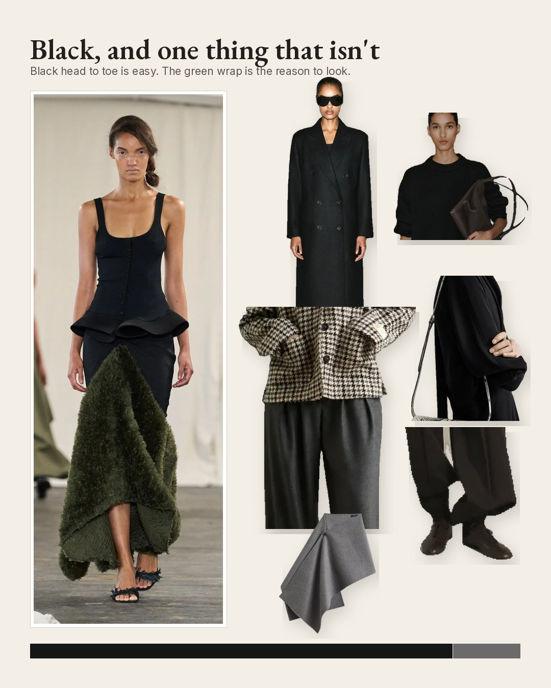 
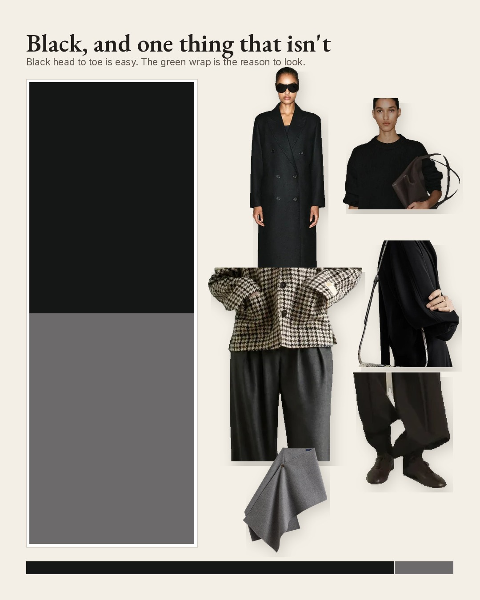 

Notes size 1080×1350, JPEG under 1 MB.

### Acceptance test

| Test | Result | Detail |
|---|---|---|
| every key colour carried | pass | all carried |
| an accent stays an accent | pass | olive on accessory |
| no foreign chromatic colour | pass | refused at selection; neutrals free |
| all components present | pass | layer, top, bottom, shoes, bag, accessory |
| neutral fillers declared | pass | none |
| no product on more than two boards | pass | checked across all six boards |

### The pieces

| # | Slot | Product | What it is | Colour | Brand | Confidence | Carries |
|---|---|---|---|---|---|---|---|
| 1 | layer | `B055-P010` | tailored double-breasted floor-length coat | black | COS | ✓ given | black (within the threshold) |
| 2 | top | `B055-P006` | crew-neck chunky knit jumper | black | COS | ✓ given | black (within the threshold) |
| 3 | bottom | `B020-P003` | wide-leg pleated flannel trousers | black | massimo alba | ✓ given | black (within the threshold) |
| 4 | shoes | `B039-P003` | soft leather lace-up derbies | black | SOEUR | ✓ given | black (within the threshold) |
| 5 | bag | `B043-P005` | snake-print flap shoulder bag | black | — | — input needed | black (within the threshold) |
| 6 | accessory | `B037-P009` | buttoned wool cape wrap | mid grey | — | — input needed | mid grey (within the threshold) |

### Note (pattern: *verdict*)

> All black is not a lack of decisions.
> >
> > A long tailored coat, a chunky roll neck, wide flannel trousers, black derbies,
> a black bag. Five black things that do not match each other, which is the point
> — and then one soft green wrap so the eye has somewhere to land.

*Not my voice yet.*

*Image sources: the inspiration photograph is someone else's photo, screenshotted from a fashion-week gallery (`content/swipe/fashion shows ss27/IMG_0805.png`) — it is colour and trend inspiration only. Every piece is a brand product shot, screenshotted from the brand or retailer's own site.*

### Swap or confirm before publishing

- `B043-P005` snake-print flap shoulder bag — brand is input needed
- `B037-P009` buttoned wool cape wrap — brand is input needed

---

## Board 6 — Cream, with brown underneath

*Cream on top, brown below, nothing else.*

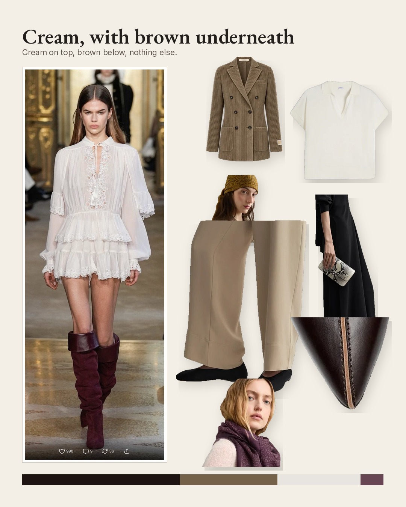 
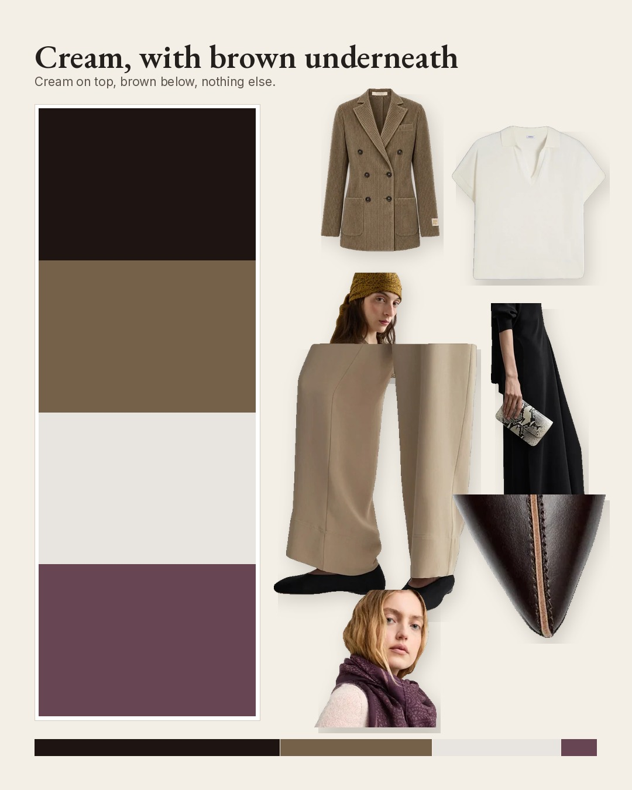 

Notes size 1080×1350, JPEG under 1 MB.

Post size, 1456px wide, with numbered labels:

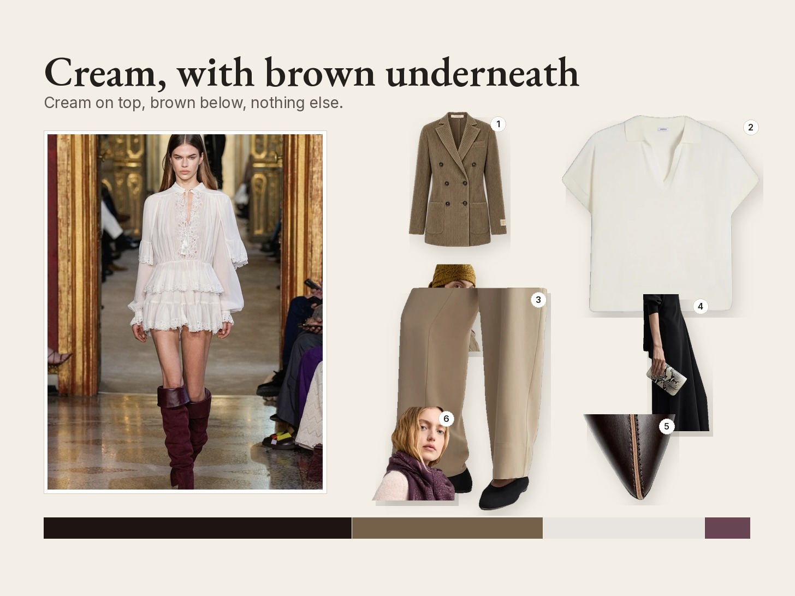 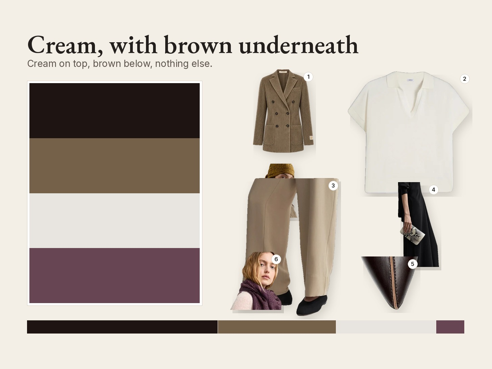

### Acceptance test

| Test | Result | Detail |
|---|---|---|
| every key colour carried | pass | all carried |
| an accent stays an accent | pass | oxblood on shoes, bag, accessory |
| no foreign chromatic colour | pass | refused at selection; neutrals free |
| all components present | pass | layer, top, bottom, shoes, bag, accessory |
| neutral fillers declared | pass | none |
| no product on more than two boards | pass | checked across all six boards |

### The pieces

| # | Slot | Product | What it is | Colour | Brand | Confidence | Carries |
|---|---|---|---|---|---|---|---|
| 1 | layer | `B021-P002` | double-breasted corduroy jacket | tobacco | massimo alba | ✓ given | tobacco (within the threshold) |
| 2 | top | `B010-P003` | cream short-sleeve open-collar knit polo | white | ASPESI | ✓ given | white (within the threshold) |
| 3 | bottom | `B042-P041` | wide-leg lounge trousers | tobacco | — | — input needed | tobacco (within the threshold) |
| 4 | shoes | `B001-P004` | pointed kitten-heel leather mules | espresso | Massimo Dutti | ✓ given | espresso (within the threshold) |
| 5 | bag | `B043-P006` | snake-print flap clutch bag | black | — | — input needed | black (within the threshold) |
| 6 | accessory | `B021-P009` | large printed stole scarf | oxblood | — | — input needed | oxblood (within the threshold) |

### Note (pattern: *label*)

> Cream on top, brown underneath.
> >
> > A corduroy jacket, a cream knitted polo, wide camel trousers, flat black shoes.
> The only strong colour is the dark red scarf, and it is the last thing you put
> on.

*Not my voice yet.*

*Image sources: the inspiration photograph is someone else's photo, screenshotted from a fashion-week gallery (`content/swipe/formats/IMG_0093.png`) — it is colour and trend inspiration only. Every piece is a brand product shot, screenshotted from the brand or retailer's own site.*

### Swap or confirm before publishing

- `B042-P041` wide-leg lounge trousers — brand is input needed
- `B043-P006` snake-print flap clutch bag — brand is input needed
- `B021-P009` large printed stole scarf — brand is input needed

---

## Four Notes with made visuals, re-rendered

Same four visuals as the first set, with the arithmetic taken off the image.
No hex codes, no lightness figures, no rule names — the caption says in plain
words what the picture already shows.

**Four colours. Every one of them fine.**

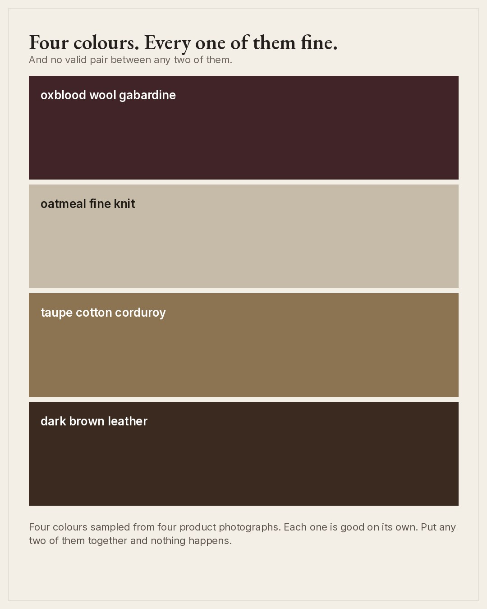

**Tan on green should be camouflage.**

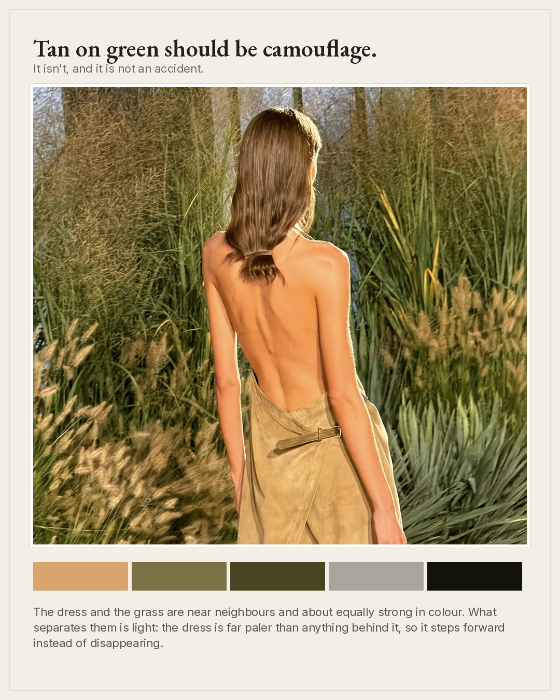

**Denim is not a colour.**

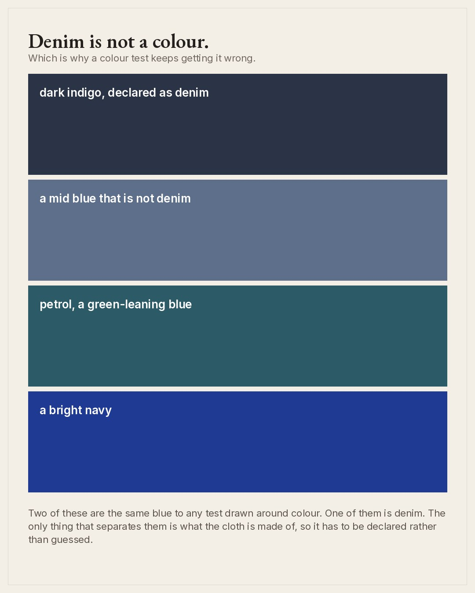

**Two reds, one step apart.**

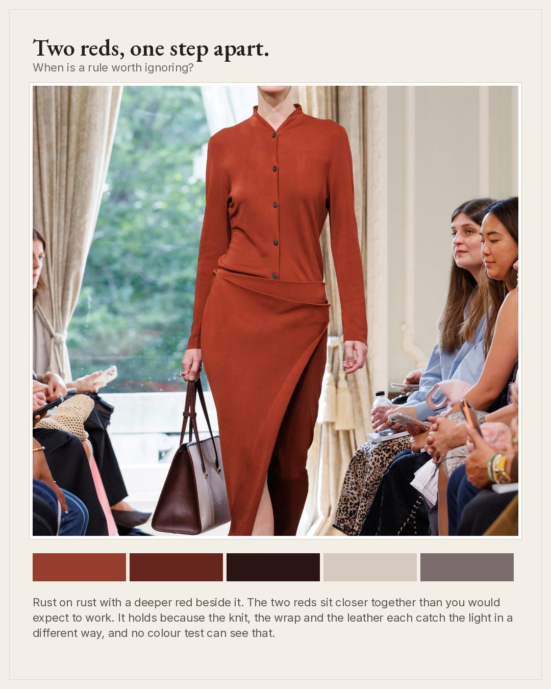

*Image sources: A and C are made — palette cards. B is someone else's photograph
(`content/swipe/visuals/IMG_0066.png`), D is someone else's photograph
(`content/swipe/fashion shows ss27/IMG_0843.png`); both swatch strips are made.*

