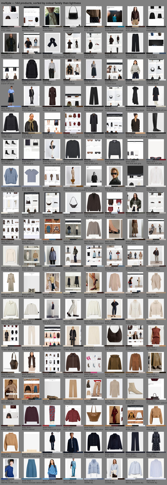
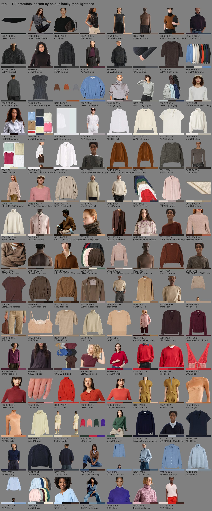
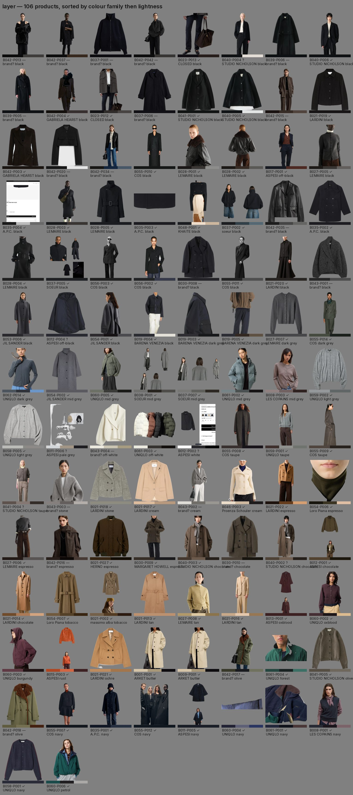
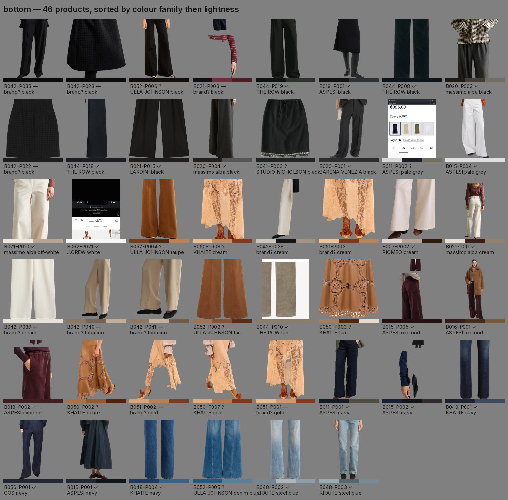
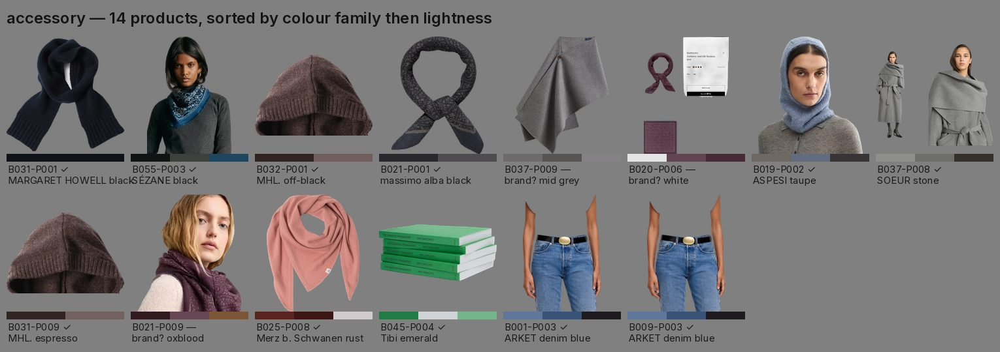
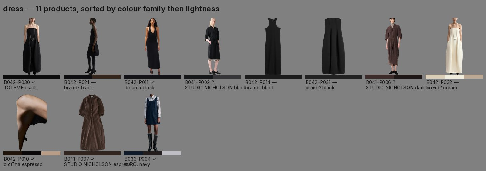
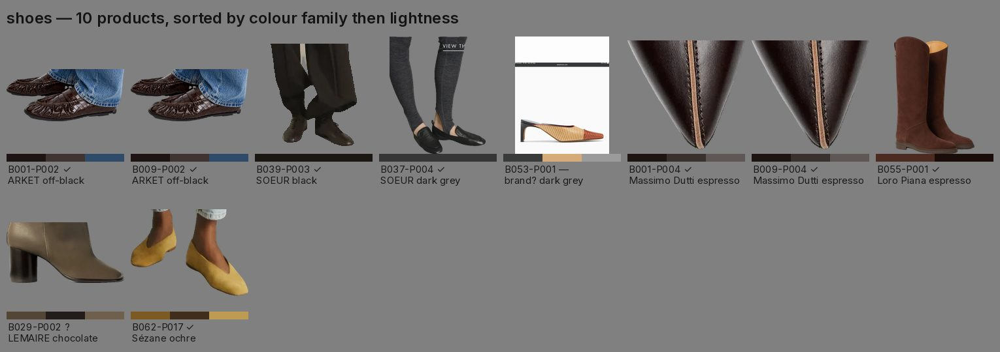
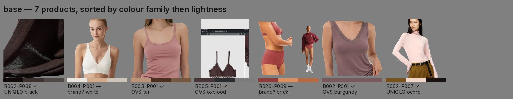
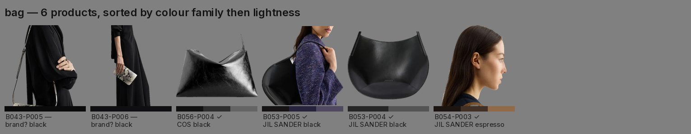

# content/catalogue — every product I have screenshotted

Built on 21 September 2026 from the images in `content/swipe/`. Every product that
appears in a screenshot has a row here. Nothing was dropped for being unbranded,
unpriced or unlabelled — missing information is recorded as missing.

## What is in here

| | |
|---|---|
| Product images in the index | 636 |
| Products (distinct pieces) | 476 |
| Shop batches | 62 |
| Products with a usable image | 476 |
| Inspiration images read for colour | 112 |
| Size added to the repository | 72.4 MB catalogue, 4.8 MB boards |

**Files.** `products.csv` one row per product · `inspiration.csv` one row per
inspiration image · `coverage.csv` which products can carry which colour in which
slot · `assets/` one image per product · `sheets/` the same thing to look at ·
`brand-questions.md` what I need from you · `asset-rejects.txt` images I opened
and judged unusable.

## Confidence, and what each value means

Brand, product name, material, price and URL each carry their own confidence.

| Value | Means |
|---|---|
| `given` | legible in the screenshot itself, or already filed in `brands/` |
| `looked up` | read off a product page I actually opened |
| `guessed` | inferred — the evidence is in `notes` and in `brand-questions.md` |
| `input needed` | nobody knows yet |

A guess is never promoted to `given`. A multi-brand page tells you the retailer,
not the brand, so those rows stay `input needed` however obvious the piece looks.

| Field | given | looked up | guessed | input needed |
|---|---|---|---|---|
| brand | 363 | 0 | 32 | 81 |
| product_name | 228 | 0 | 0 | 248 |
| material | 124 | 0 | 0 | 352 |
| price | 231 | 0 | 0 | 245 |
| product_url | 0 | 0 | 0 | 476 |

**Product URLs are all `input needed`.** Shop sites are blocked from the
environment this ran in: every HTTPS request to a brand domain came back 403 at
the proxy. Web *search* works, but a search result is not a page I opened, so it
cannot produce `looked up`. Step 9 was skipped, as agreed.

## Colour

Up to three colours per product, read off the saved image with the garment
isolated — the shop page behind it and the skin of the model wearing it are masked
out first. Each colour carries its hex, L*, chroma, hue angle, the relative chroma
the engine uses, its neutral flag, a family and a plain name from a closed list.

| Family | Products |
|---|---|
| black | 132 |
| brown | 79 |
| warm neutral | 77 |
| blue | 52 |
| grey | 36 |
| red | 25 |
| yellow | 21 |
| white | 20 |
| cool neutral | 12 |
| orange | 9 |
| green | 9 |
| pink | 2 |
| purple | 2 |

Names inside a family: black / off-black · white / off-white · cream, oatmeal,
stone, taupe · pale / light / mid / dark grey · espresso, chocolate, tobacco, tan ·
oxblood, burgundy, brick, red · rust, terracotta, apricot · ochre, mustard, gold,
butter · olive, moss, sage, forest, emerald · petrol, navy, denim blue, steel blue,
sky · aubergine, plum, violet, lilac, mauve · raspberry, dusty rose, blush.

**Rust and plum are never the same family** — rust is `orange`, plum is `purple`.
A colour is a neutral because it uses little of the chroma available at its
lightness, not because it is pale; naming and pairing are different questions, so a
pale blue is filed under `blue` and carries the neutral flag separately.

| colour_confidence | Products |
|---|---|
| high | 65 |
| medium | 298 |
| low | 113 |

`low` means one of: the piece was only ever photographed on a model, the mask left
very little to read, or a satin or patent surface blew out the highlight.

**White balancing does not help, so it is off.** Measured on 50 products
photographed more than once: without it the two shots of one product disagree by a
median of 0.9 (dE2000) and a mean of 2.7; with it, 1.4 and 3.9. It narrowed the
spread on 2 products and widened it on 10.

**Stability.** 115 products have more than one screenshot. Across those the two
readings disagree by a median of 1.1, a 90th percentile of 4.5 and a worst case of
29.6; 10 are marked `unstable`.

## Images

| Asset type | Count | |
|---|---|---|
| flat cut-out | 99 | packshot, background removed |
| on-model cut-out | 227 | person removed from the page, then cropped to the band where the piece sits |
| crop tile | 150 | a clean rectangle of the page, no UI and no text |

| Quality | Count |
|---|---|
| good | 398 |
| usable | 21 |
| weak | 57 |

`weak` is not a rejection — the row stays and the image is still there. It means
the cut-out is mostly skin and hair, or it is a rectangle (a page panel rather than
a piece), or no product could be located in the screenshot at all.

## Sheets

One sheet per slot, sorted by colour family and then by lightness. Each cell is the
image, its three colours, the product id, the brand and a confidence mark
(✓ given · ? guessed · — input needed).

**multiple — 144 products**

**top — 132 products**

**layer — 106 products**

**bottom — 46 products**

**accessory — 14 products**

**dress — 11 products**

**shoes — 10 products**

**base — 7 products**

**bag — 6 products**

`multiple` is a listing-grid screenshot showing several products at once. Those
rows are real and catalogued, but they are not usable as a single piece on a board.

## Coverage

`coverage.csv` answers, for every inspiration image and every key colour in it,
which products in which slot can carry that colour. The thresholds started at
dE2000 under 12 for a match and 12–20 for a near miss, and I left them there: on
the sheets, 12 is about where two garments stop reading as the same colour and
start reading as neighbours.

### The fifteen best-supported inspiration images

| # | Image | Key colours | Slots filled with a true match | Neutral fillers |
|---|---|---|---|---|
| 1 | `content/swipe/formats/IMG_0140.png` | denim blue, petrol, black | 6 of 6 | 0 |
| 2 | `content/swipe/fashion shows ss27/IMG_0854.png` | navy, denim blue, chocolate | 6 of 6 | 0 |
| 3 | `content/swipe/fashion shows ss27/IMG_0860.png` | oxblood, plum, rust | 6 of 6 | 0 |
| 4 | `content/swipe/visuals/IMG_0136.png` | olive, olive, tan | 6 of 6 | 0 |
| 5 | `content/swipe/visuals/IMG_0145.png` | mid grey, dark grey, rust, off-white | 6 of 6 | 0 |
| 6 | `content/swipe/formats/IMG_0488.png` | white, tobacco, dark grey, butter | 6 of 6 | 0 |
| 7 | `content/swipe/visuals/IMG_0066.png` | gold, ochre, chocolate | 4 of 6 | 2 |
| 8 | `content/swipe/fashion shows ss27/IMG_0839.png` | brick, rust, white | 4 of 6 | 2 |
| 9 | `content/swipe/fashion shows ss27/IMG_0856.png` | raspberry, plum, rust | 3 of 6 | 3 |
| 10 | `content/swipe/fashion shows ss27/IMG_0851.png` | violet, dusty rose, oxblood | 3 of 6 | 3 |
| 11 | `content/swipe/fashion shows ss27/IMG_0805.png` | off-black, olive | 6 of 6 | 0 |
| 12 | `content/swipe/fashion shows ss27/IMG_0823.png` | black, navy, pale grey | 6 of 6 | 0 |
| 13 | `content/swipe/fashion shows ss27/IMG_0815.png` | tan, espresso | 6 of 6 | 0 |
| 14 | `content/swipe/fashion shows ss27/IMG_0814.png` | black, ochre, olive | 6 of 6 | 0 |
| 15 | `content/swipe/formats/IMG_0093.png` | cream, tobacco, oxblood | 6 of 6 | 0 |

### The six looks from the first set, re-tested

| Look | Key colour | Match in the library | Best piece |
|---|---|---|---|
| IMG_0825.png | pale grey (dominant) | yes | `B057-P006` cashmere crew neck jumper |
| IMG_0825.png | steel blue (accent) | yes | `B048-P003` high-rise straight-leg jeans |
| IMG_0811.png | black (dominant) | yes | `B061-P003` quilted hooded down parka |
| IMG_0811.png | gold (accent) | yes | `B062-P017` flat pointed ballerina pumps |
| IMG_0811.png | taupe (secondary) | yes | `B031-P005` crew neck knit jumper |
| IMG_0843.png | rust (dominant) | yes | `B062-P005` long-sleeve ribbed t-shirt |
| IMG_0843.png | off-black (accent) | yes | `B041-P008` half-zip knitted sweater |
| IMG_0860.png | oxblood (dominant) | yes | `B015-P005` wide-leg smooth velvet trous |
| IMG_0860.png | plum (secondary) | yes | `B014-P001` boat-neck merino knit jumper |
| IMG_0860.png | rust (accent) | yes | `B031-P008` crew neck knit jumper |
| IMG_0862.png | black (dominant) | yes | `B030-P009` double-breasted wool pea coa |
| IMG_0862.png | off-white (secondary) | yes | `B033-P001` crew neck wool jumper |
| IMG_0862.png | oatmeal (secondary) | yes | `B043-P002` double-breasted shawl-collar |
| IMG_0862.png | brick (accent) | yes | `B045-P002` v-neck raglan sweatshirt |
| IMG_0851.png | violet (dominant) | yes | `B011-P004` chambray button-front shirt |
| IMG_0851.png | dusty rose (secondary) | yes | `B057-P003` funnel-neck oversized shirt |
| IMG_0851.png | oxblood (accent) | yes | `B060-P003` hooded utility parka |

## What to collect next

In plain words, the five things the library most needs:

1. **Shoes.** Ten pairs in the whole library, and two of them unusable as images.
   Six boards need at least three distinct pairs before anything repeats. Flat
   packshots on white — black, brown, and one pale.
2. **Bags.** Six. The same problem, worse. A black one, a brown one and one with a
   colour in it would cover most looks.
3. **Anything green, purple or pink.** Seven green products, four purple, two pink,
   against 137 black. Every look built on a green or a lilac runs out of pieces
   immediately — which is why one board here reads grey where the look reads lilac.
4. **Bottoms.** Forty-six, against 119 tops and 106 layers. Trousers and skirts in
   rust, olive and ochre specifically.
5. **Flat packshots instead of listing grids.** 144 products exist only inside a
   grid screenshot. One tap into the product page turns each of them into a piece
   that can go on a board.

## How validation will work

Nothing to do here today. When you want to start checking rows: filter
`products.csv` by `used_in`, which lists the boards a product has appeared on, so
the pieces that have actually been published come first. Fill in `validated`
yourself — a date, or your initials, whatever suits. A later run reads that column,
leaves anything validated alone, and refreshes names, brands and links for
everything else from the catalogue. Every board and every Note references a
`product_id`, so a correction made once flows to all of them.

