# brand-questions.md

One question per shop batch, not per product — a batch is a run of screenshots
from the same shop, so one answer fills in every row in it. Numbered so you can
answer in one message: *1 Toteme, 4 no idea, 7 Lemaire*.

Nothing here is guessed into the catalogue. Where I had to guess, the row says
`guessed` and the evidence is below.

Safari's address bar is now read off each screenshot. A domain that is a brand
the repository already holds sets that brand at `guessed`, with the domain as its
evidence — a domain is strong, but it is not the page naming the brand, so it is
never `given`. A domain that matches no filed brand sets the shop and nothing
else. Confirm or correct per batch below.

### 1. Batch `B004` — 1 product

- **Address bar:** not legible
- **Shop text on the page:** not legible
- **Layout:** unknown
- **Brands legible elsewhere in this batch:** none
- **My best guess:** *none — nothing in the batch names a brand*
- **Evidence:** a multi-brand layout tells you the retailer, not the brand
- **Products waiting on this:** B004-P001

### 2. Batch `B006` — 1 product

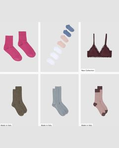

- **Address bar:** not legible
- **Shop text on the page:** not legible
- **Layout:** unknown
- **Brands legible elsewhere in this batch:** none
- **My best guess:** *none — nothing in the batch names a brand*
- **Evidence:** a multi-brand layout tells you the retailer, not the brand
- **Products waiting on this:** B006-P001

### 3. Batch `B010` — 1 product

- **Address bar:** `aspesi.com` on 11 of 12 screenshots
- **Shop text on the page:** aspesi.com
- **Layout:** mono-brand
- **Brands legible elsewhere in this batch:** ASPESI
- **My best guess:** ASPESI
- **Evidence:** the shop is mono-brand and every legible brand in the batch is the same
- **Products waiting on this:** B010-P002

### 4. Batch `B011` — 2 products

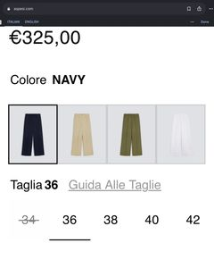 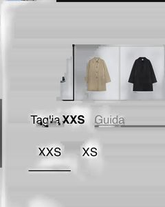

- **Address bar:** `aspesi.com` on 9 of 9 screenshots
- **Shop text on the page:** aspesi.com
- **Layout:** mono-brand
- **Brands legible elsewhere in this batch:** ASPESI
- **My best guess:** ASPESI
- **Evidence:** the shop is mono-brand and every legible brand in the batch is the same
- **Products waiting on this:** B011-P002, B011-P006

### 5. Batch `B012` — 2 products

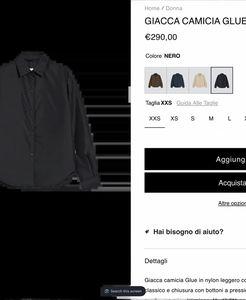 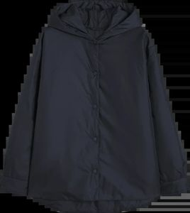

- **Address bar:** `aspesi.com` on 5 of 6 screenshots
- **Shop text on the page:** aspesi.com
- **Layout:** mono-brand
- **Brands legible elsewhere in this batch:** ASPESI
- **My best guess:** ASPESI
- **Evidence:** the shop is mono-brand and every legible brand in the batch is the same
- **Products waiting on this:** B012-P002, B012-P004

### 6. Batch `B016` — 1 product

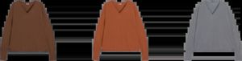

- **Address bar:** `aspesi.com` on 4 of 5 screenshots
- **Shop text on the page:** aspesi.com
- **Layout:** mono-brand
- **Brands legible elsewhere in this batch:** ASPESI
- **My best guess:** ASPESI
- **Evidence:** the shop is mono-brand and every legible brand in the batch is the same
- **Products waiting on this:** B016-P002

### 7. Batch `B020` — 2 products

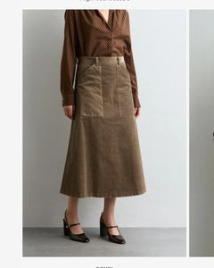 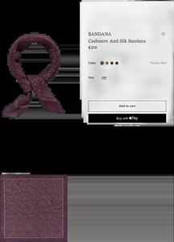

- **Address bar:** `barenavenezia.com` on 3 of 8 screenshots
- **Shop text on the page:** barenavenezia.com
- **Layout:** mono-brand
- **Brands legible elsewhere in this batch:** BARENA VENEZIA, massimo alba
- **My best guess:** massimo alba
- **Evidence:** URL bar, massimoalba.com
- **Products waiting on this:** B020-P005, B020-P006
- **Careful:** this batch also shows `massimoalba.com` in its address bar, so the clustering has run two shops together.

### 8. Batch `B021` — 4 products

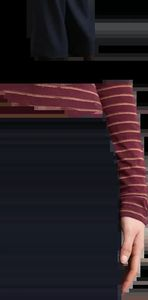 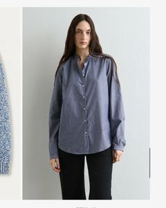

- **Address bar:** `massimoalba.com` on 17 of 38 screenshots
- **Shop text on the page:** massimoalba.com
- **Layout:** mono-brand
- **Brands legible elsewhere in this batch:** HERNO, LARDINI, massimo alba
- **My best guess:** massimo alba
- **Evidence:** URL bar, massimoalba.com
- **Products waiting on this:** B021-P003, B021-P008, B021-P009, B021-P012
- **Careful:** this batch also shows `lardini.com`, `herno.com`, `boglioli.it` in its address bar, so the clustering has run two shops together.

### 9. Batch `B026` — 9 products

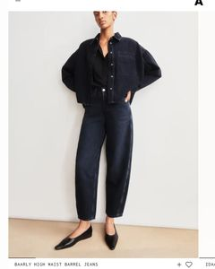 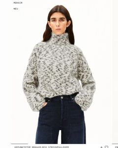

- **Address bar:** `armedangels.com` on 11 of 13 screenshots
- **Shop text on the page:** armedangels.com
- **Layout:** multi-brand
- **Brands legible elsewhere in this batch:** LEMAIRE, OFFICINE GÉNÉRALE
- **My best guess:** *none — nothing in the batch names a brand*
- **Evidence:** a multi-brand layout tells you the retailer, not the brand
- **Products waiting on this:** B026-P001, B026-P002, B026-P003, B026-P004, B026-P005, B026-P006, B026-P007, B026-P008, B026-P009
- **Careful:** this batch also shows `ch.officinegenerale.com`, `lemaire.fr` in its address bar, so the clustering has run two shops together.

### 10. Batch `B028` — 4 products

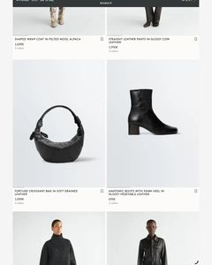 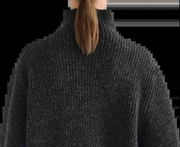

- **Address bar:** `lemaire.fr` on 19 of 20 screenshots
- **Shop text on the page:** lemaire.fr
- **Layout:** mono-brand
- **Brands legible elsewhere in this batch:** LEMAIRE
- **My best guess:** LEMAIRE
- **Evidence:** the shop is mono-brand and every legible brand in the batch is the same
- **Products waiting on this:** B028-P006, B028-P008, B028-P011, B028-P013

### 11. Batch `B029` — 1 product

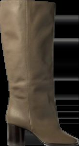

- **Address bar:** `lemaire.fr` on 3 of 3 screenshots
- **Shop text on the page:** lemaire.fr
- **Layout:** mono-brand
- **Brands legible elsewhere in this batch:** LEMAIRE
- **My best guess:** LEMAIRE
- **Evidence:** the shop is mono-brand and every legible brand in the batch is the same
- **Products waiting on this:** B029-P002

### 12. Batch `B030` — 6 products

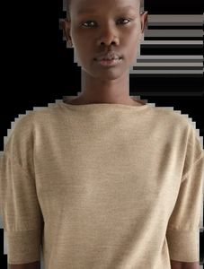 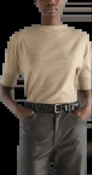

- **Address bar:** `lemaire.fr` on 6 of 13 screenshots
- **Shop text on the page:** lemaire.fr
- **Layout:** mono-brand
- **Brands legible elsewhere in this batch:** LEMAIRE, MARGARET HOWELL
- **My best guess:** lemaire
- **Evidence:** URL bar, lemaire.fr
- **Products waiting on this:** B030-P001, B030-P002, B030-P005, B030-P006, B030-P008, B030-P010

### 13. Batch `B031` — 3 products

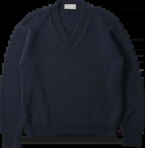 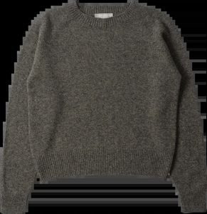

- **Address bar:** not legible
- **Shop text on the page:** margarethowell.co.uk
- **Layout:** multi-brand
- **Brands legible elsewhere in this batch:** MARGARET HOWELL, MHL.
- **My best guess:** *none — nothing in the batch names a brand*
- **Evidence:** a multi-brand layout tells you the retailer, not the brand
- **Products waiting on this:** B031-P004, B031-P006, B031-P008

### 14. Batch `B037` — 3 products

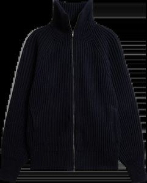 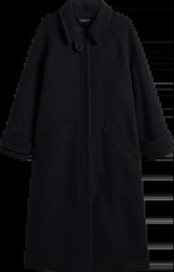

- **Address bar:** `ch.soeur.fr` on 13 of 13 screenshots
- **Shop text on the page:** ch.soeur.fr
- **Layout:** mono-brand
- **Brands legible elsewhere in this batch:** SOEUR, soeur
- **My best guess:** soeur
- **Evidence:** URL bar, ch.soeur.fr
- **Products waiting on this:** B037-P001, B037-P006, B037-P009

### 15. Batch `B039` — 4 products

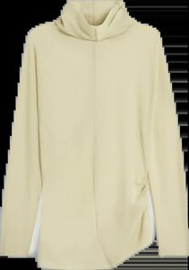 

- **Address bar:** `studionicholson.com` on 4 of 8 screenshots
- **Shop text on the page:** ch.soeur.fr
- **Layout:** mono-brand
- **Brands legible elsewhere in this batch:** SOEUR, STUDIO NICHOLSON
- **My best guess:** soeur
- **Evidence:** URL bar, ch.soeur.fr
- **Products waiting on this:** B039-P001, B039-P004, B039-P005, B039-P006
- **Careful:** this batch also shows `ch.soeur.fr` in its address bar, so the clustering has run two shops together.

### 16. Batch `B040` — 2 products

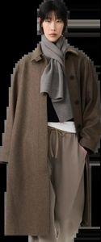 

- **Address bar:** `studionicholson.com` on 7 of 8 screenshots
- **Shop text on the page:** studionicholson.com
- **Layout:** mono-brand
- **Brands legible elsewhere in this batch:** STUDIO NICHOLSON
- **My best guess:** STUDIO NICHOLSON
- **Evidence:** the shop is mono-brand and every legible brand in the batch is the same
- **Products waiting on this:** B040-P002, B040-P004

### 17. Batch `B041` — 6 products

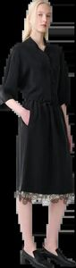 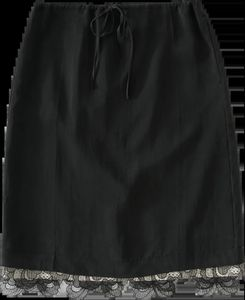

- **Address bar:** `studionicholson.com` on 8 of 9 screenshots
- **Shop text on the page:** studionicholson.com
- **Layout:** mono-brand
- **Brands legible elsewhere in this batch:** STUDIO NICHOLSON
- **My best guess:** STUDIO NICHOLSON
- **Evidence:** the shop is mono-brand and every legible brand in the batch is the same
- **Products waiting on this:** B041-P002, B041-P003, B041-P004, B041-P006, B041-P008, B041-P009

### 18. Batch `B042` — 31 products

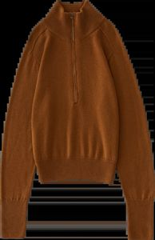 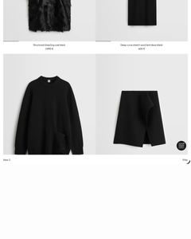

- **Address bar:** `toteme.com` on 39 of 53 screenshots
- **Shop text on the page:** studionicholson.com
- **Layout:** mono-brand
- **Brands legible elsewhere in this batch:** BODE, GABRIELA HEARST, TOTEME, diotīma
- **My best guess:** studio nicholson
- **Evidence:** URL bar, studionicholson.com
- **Products waiting on this:** B042-P001, B042-P012, B042-P013, B042-P014, B042-P015, B042-P016, B042-P017, B042-P018, B042-P019, B042-P020, B042-P021, B042-P022, B042-P023, B042-P024, B042-P025, B042-P026, B042-P027, B042-P028, B042-P029, B042-P031, B042-P032, B042-P033, B042-P034, B042-P035, B042-P036, B042-P037, B042-P038, B042-P039, B042-P040, B042-P041, B042-P042
- **Careful:** this batch also shows `bode.com`, `gabrielahearst.com`, `studionicholson.com` in its address bar, so the clustering has run two shops together.

### 19. Batch `B043` — 7 products

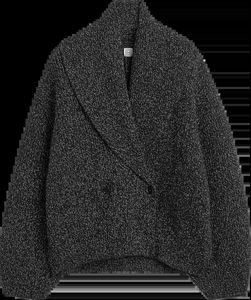 

- **Address bar:** `toteme.com` on 12 of 12 screenshots
- **Shop text on the page:** toteme.com
- **Layout:** mono-brand
- **Brands legible elsewhere in this batch:** none
- **My best guess:** toteme
- **Evidence:** URL bar, toteme.com
- **Products waiting on this:** B043-P001, B043-P002, B043-P003, B043-P004, B043-P005, B043-P006, B043-P007

### 20. Batch `B044` — 4 products

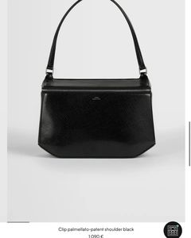 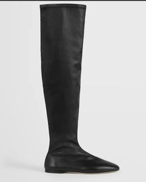

- **Address bar:** `therow.com` on 16 of 27 screenshots
- **Shop text on the page:** toteme.com
- **Layout:** mono-brand
- **Brands legible elsewhere in this batch:** THE ROW, TOTEME, Tibi
- **My best guess:** toteme
- **Evidence:** URL bar, toteme.com
- **Products waiting on this:** B044-P001, B044-P002, B044-P003, B044-P004
- **Careful:** this batch also shows `toteme.com`, `tibi.com` in its address bar, so the clustering has run two shops together.

### 21. Batch `B050` — 7 products

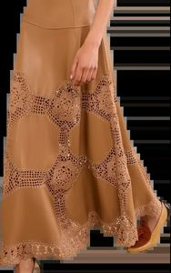 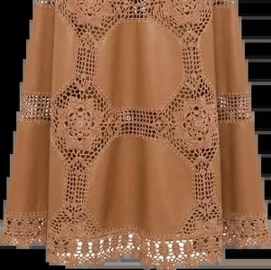

- **Address bar:** `ullajohnson.com` on 7 of 12 screenshots
- **Shop text on the page:** khaite.com
- **Layout:** mono-brand
- **Brands legible elsewhere in this batch:** KHAITE
- **My best guess:** KHAITE
- **Evidence:** the shop is mono-brand and every legible brand in the batch is the same
- **Products waiting on this:** B050-P002, B050-P003, B050-P004, B050-P005, B050-P006, B050-P007, B050-P008
- **Careful:** this batch also shows `khaite.com` in its address bar, so the clustering has run two shops together.

### 22. Batch `B051` — 4 products

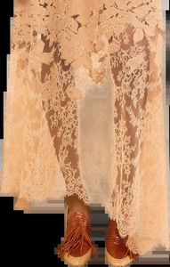 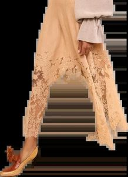

- **Address bar:** `ullajohnson.com` on 5 of 5 screenshots
- **Shop text on the page:** ullajohnson.com
- **Layout:** mono-brand
- **Brands legible elsewhere in this batch:** none
- **My best guess:** ulla johnson
- **Evidence:** URL bar, ullajohnson.com
- **Products waiting on this:** B051-P001, B051-P002, B051-P003, B051-P004

### 23. Batch `B052` — 6 products

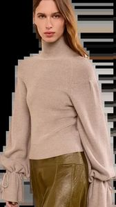 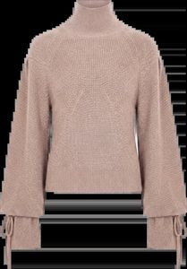

- **Address bar:** `ullajohnson.com` on 7 of 7 screenshots
- **Shop text on the page:** ullajohnson.com
- **Layout:** mono-brand
- **Brands legible elsewhere in this batch:** ULLA JOHNSON
- **My best guess:** ULLA JOHNSON
- **Evidence:** the shop is mono-brand and every legible brand in the batch is the same
- **Products waiting on this:** B052-P001, B052-P002, B052-P003, B052-P004, B052-P005, B052-P006

### 24. Batch `B053` — 2 products

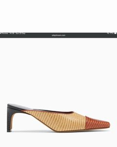 

- **Address bar:** `rachelcomey.com` on 4 of 11 screenshots
- **Shop text on the page:** ullajohnson.com
- **Layout:** mono-brand
- **Brands legible elsewhere in this batch:** JIL SANDER, RACHEL COMEY
- **My best guess:** ulla johnson
- **Evidence:** URL bar, rachelcomey.com
- **Products waiting on this:** B053-P001, B053-P003
- **Careful:** this batch also shows `jilsander.com`, `ullajohnson.com` in its address bar, so the clustering has run two shops together.

